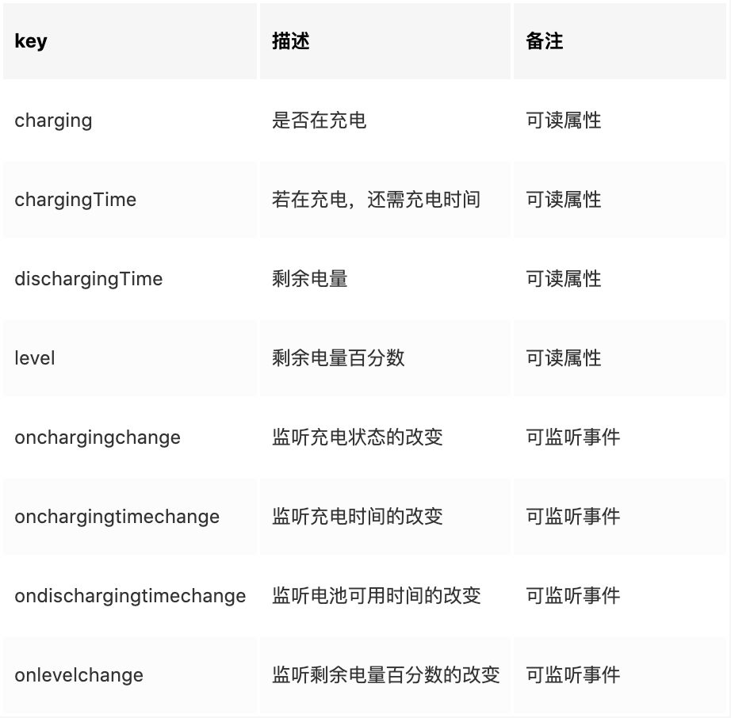
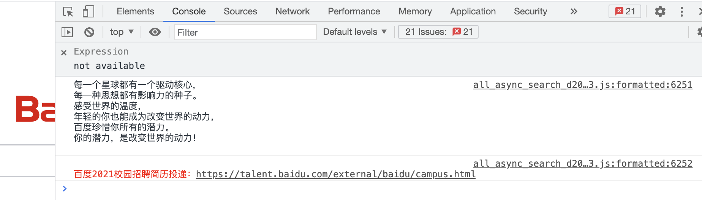

记录工作中遇到的有关JavaScript的问题。

## 1. 资源在js中通过import引用

### 场景
在data中或通过方法对资源的地址赋值，无法引用到该资源。

### 原因
在template模版里的路径会被webpack解析打包，而放在data和method中的路径，只是一个字符串，webpack不会处理。

### 解决方案
通过import或required引入。

## 2. 方法参数的传递，优先使用对象格式。

###原因：
1. 便于参数的扩展；
2. 有一定的自解释性；
3. 对于顺序不要求

## 3. 尽量不要通过script引用资源

### 场景
在html页面通过script标签引用资源，资源一直pending页面无法展现（诗词大会6月5日因openinstall资源加载未响应导致页面阻塞，用户两小时无法进入诗词大会）

```html
<script type="text/javascript" charset="UTF-8" src="https://prod-opis-api.tipaipai.com/js/tipaipai.js"></script>
```

### 原因
浏览器加载静态资源和js的方式都是线性加载，资源加载未响应会阻塞render tree的解析以及渲染

### 解决方案
1. 有npm尽量通过npm引入；
2. 为script标签添加async，async让浏览器异步加载脚本文件，不影响浏览器对render tree的解析；
3. 动态创建script标签；
4. cdn资源下载到本地，通过本地方式引入；
5. 静态页面可以吧script标签添加在body标签闭合之前；

## 3. vue-cli模版已有babel无法转义??(空值合并)和?.(可选链)

### 场景
使用??(控制合并)和?.(可选链)在低版本浏览器不兼容

### 原因
vue-cli模版已有babel不支持转义??(空值合并)和?.(可选链)

### 解决方案
使用以下两个babel插件转义
@babel/plugin-proposal-nullish-coalescing-operator ??(空值合并)
@babel/plugin-proposal-optional-chaining ?.(可选链)

## 4.监听屏幕旋转变化 orientationchange
```javascript
window.addEventListener("orientationchange", function() {
  console.log(screen.orientation.angle)
});
```
screen.orientation.angle的值: 0 竖屏，90 向左横屏， 270 向右横屏， 180 倒屏。

## 5.电池状态 navigator.getBattery()
这个api返回的是一个promise对象，会给出一个BatteryManager对象，对象中包含了以下信息：

使用方法：
```javascript
if (navigator.getBattery) {
    navigator.getBattery().then(battery => {})
}
```
兼容性参考 https://developer.mozilla.org/zh-CN/docs/Web/API/Navigator/getBattery

## 6.页面可编辑：contentEditable
使用场景：输入框输入状态下高度会随文本内容自动撑开，可以代替textarea标签
```html
<div contentEditable='true' />
```
## 7.console.log的妙用
使用场景：console.log打印不同样式的内容;

案例：

```javascript
window.console && window.console.log && 
(console.log("每一个星球都有一个驱动核心，\n每一种思想都有影响力的种子。\n感受世界的温度，\n年轻的你也能成为改变世界的动力，\n百度珍惜你所有的潜力。\n你的潜力，是改变世界的动力！\n\n"),
console.log("%c百度2021校园招聘简历投递：https://talent.baidu.com/external/baidu/campus.html", "color:red"))
```
使用方法：
```javascript
console.log("%c这里是打印内容！", "color:red;font-size:30px;background:yellow;"))
console.log("%chello everybody %c今年是2021年","font-size:30px;background:red;color:#ffffff","font-size:16px;color:#ccc")
```