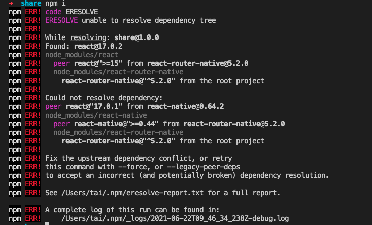

记录工作中遇到的有关包管理的问题。

## 1. package.json升级注意事项
当第一次 `git clone`项目到本地时，要先执行 `npm install` 安装依赖包，保证`node_modules`中包的完整性，然后执行 `npm update`, 如果在没安装依赖包时直接执行 `npm update`，会导致 `package.json` 没有自动更新

## 2. peerDependencies依赖的使用
对于安装的依赖包，如果其package.json字段中存在peerDependencies字段，其包含的依赖将安装到父依赖包同级。这样避免了重复下载和多版本共存问题。
```
比如有一个项目依赖PackageA、PackageB，PackageA包的package.json文件指定了对PackageB的依赖：
MyProject
|- node_modules
   |- PackageB
   |- PackageA
      |- node_modules
         |- PackageB
```
假如packageA.json文件中这样定义：
```
{
    "peerDependencies": {
        "PackageB": "1.0.0"
    }
}
```
最终的依赖安装结构如下：
```
MyProject
|- node_modules
   |- PackageA
   |- PackageB
```
对于peerDependencies安装引起的冲突问题常见解决办法
#### 如测试项目的package.json如下：

#### npm安装



#### yarn安装

