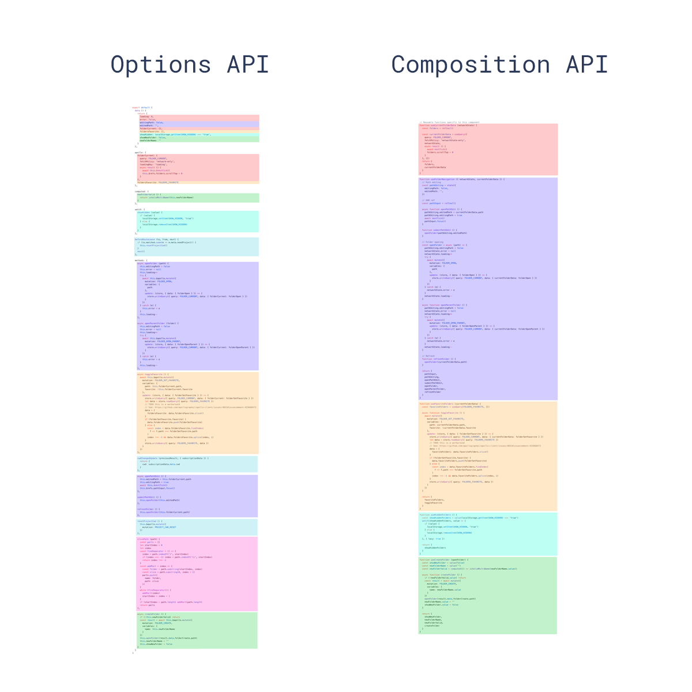

## 一、组件设计原则

将组件设计为“黑盒子”，即功能确定的纯组件，外部对其使用依赖于确定值：即确定最少的`props`输入和确定完善的`events`输出。

### 1.1 规范
1. 始终使用 kebab-case 的事件名（[原因](https://cn.vuejs.org/v2/guide/components-custom-events.html#事件名)）
2. 超过100行的Vue文件应拆分为独立的`.js`，`.css`，`vue`文件；
3. 事件类型统一添加`on-`前缀，即`this.$emit('on-success', value)`；
4. 事件处理器统一添加`handle`前缀，即`@on-success="handleUpdateNameSuccess"`；

### 1.2 `v-model` 使用原则
1. 尽量不要使用，`v-model` 的黑魔法是从组件的黑盒子内部对一个值的“突变”，存在不确定性和不可控性；
2. 不确定性是无法确定值的改变是由外部代码操控，还是组件内部触控；
3. 不可控性跟不确定性类似，组件的黑盒子内部可以不受外部控制的改变值，而这个值有可能会对外部的程序产生副作用。

### 1.3 `v-model` 的合适使用场景
1. 表单型组件（比如`IInput`）的处理，在该场景下，表单组件的`value`是在外部明确期望获取的，而且明确由组件内部输入控制的，是对`onChange`的简写形式（本质上：期待的数据流向是明确的，从内部流向外部）。
2. 组件可完全控制的场景。

### 1.4 `v-model`案例
```html
// 父组件
<TaiSlider
  v-model="form.disk" // form表单期望获取的值
  :min="20"
  :max="1000"
/>

// 子组件
<div class="tai-form-slider">
  <div class="tai-slider-content">
    <ISlider
      :value="innerValue"  // 重新定义的值
      :min="minSize"
      :max="maxSize"
      :step="step"
      name="disk"
      show-tip="hover"
      class="tai-slider"
      @on-input="handleChangeDisk"
    />
    <IInputNumber
      :value="innerValue"
      :min="minSize"
      :max="maxSize"
      :step="step"
      @on-change="handleChangeDisk"
      @on-blur="handleBlurInput"
    />GB
  </div>
  <div class="tai-slider-tip">
    <span class="min-size">{{ minSize }}GB</span>
    <span class="max-size">{{ maxSize }}GB</span>
    <span class="ram-tip">存储空间{{ minSize }}GB～{{ maxSize }}GB</span>
  </div>
</div>

// watch中监听，将传入的value值赋值给新定义的值，避免直接影响操作外部值。
value() {
  this.innerValue = this.value;
},
```

#### `.sync`和`v-model`的区别
1. 暂时没有想到两者严格的差异🤪；
2. 表面上看只是`$emit 'input'`和`$emit 'update'`的区别（[.sync](https://cn.vuejs.org/v2/guide/components-custom-events.html#sync-修饰符)）。
3. 一个组件上的 v-model 默认会利用名为 value 的 prop 和名为 input 的事件（https://cn.vuejs.org/v2/guide/components-custom-events.html#自定义组件的-v-model)
3. 建议优先用明确的事件完成子组件的输出。

## 二、Widget模式
Widget 模式名字借鉴于 [Web Widget](https://zh.wikipedia.org/wiki/Web_Widget)，与其含义基本相同，表示小部件、小工具、挂件等，包含可在任意地方直接调用并执行的含义。

在一个页面中可以存在多个Vue实例，将独立小组件封装成单独Vue的实例，并提供函数的调用接口，即Widget。

需要使用的时候即直接调用，本质上是在DOM种插入新的Vue实例，通过回调或Promise的形式完成数据的传递。

### 2.1 解决的问题
在典型的Vue架构中，UI组件的展示是对组件树中某个组件的状态改变（v-if、v-show等），对于跟业务代码执行某个小分叉逻辑有关的独立小组件（比如 Alert、Confirm、Prompt、Tip 等）有些刻板和沉重，在这种情况下，更有利于调用函数等形式会更便于使用。

由于减少了组件树中此类组件的占位，也可以优化程序的性能。


### 2.2 案例
如下示例，将登陆弹窗封装为Widget，方便引用和函数化调用。

```js
import Vue from 'vue';
import LoginForm from '@/common/components/LoginForm.vue';
import store from '@/store';

export default function login(resolve, reject) {
  let component;

  function wrap(callback, payload) {
    return () => {
      document.body.removeChild(component.$el);
      if (callback) {
        callback(payload);
      }
    };
  }

  const instance = new Vue({
    store,
    render(h) {
      return h('div', {
        style: {
          position: 'fixed',
          top: 0,
          bottom: 0,
          left: 0,
          right: 0,
          zIndex: 900,
          display: 'flex',
          alignItems: 'center',
          justifyContent: 'center',
          backgroundColor: 'rgba(55, 55, 55, 0.6)',
        },
      }, [
        h(LoginForm, {
          on: {
            'on-success': wrap(resolve),
            'on-failure': wrap(reject, { message: '登录失败' }),
          },
        }),
      ]);
    },
  });

  component = instance.$mount();

  document.body.appendChild(component.$el);
}
```


## 三、Directive模式

### 3.1 原则
当逻辑非常简单固定，可以使用指令来实现。定义一套标准指令，来完成固定行为。

### 3.2 规范
1. 脱离业务逻辑而抽象出来的公用的指令，放在common的directives文件夹中并且全局定义指令；
2. 在业务模块中，指令定义在模块的directives文件夹中。需要使用指令的组件，引用directive并在组件中定义本地的指令；

### 3.3 案例
timelyValidate.js，用于尽早消除表单错误，示例如下：

```js
/**
 * # 表单验证时机
 * 表单共有两种：
 * 1. 选择型；
 * 2. 输入型。
 *
 * 针对选择型表单，建议设置默认值，如果不能设置默认值，直接设置检验时机为**change**（单个表单的blur意义不大，一组表单的blur比较复杂，保证用户操作体验的前提下先简化处理）。
 *
 * 输入型表单的验证时机
 * 1. input表单第一次提交表单验证的时机是**blur**（初次输入时，让用户保持安静以完整输入，避免初次输入时对用户的频繁干扰）；
 * 2. 当验证触发后（1中的blur或表单的提交触发），将输入型表单的验证时机调整为**change**（尽快消除错误，让用户尽早恢复喜悦）。
 *
 * ## 注意
 * 该指令未实现非blur和非submit的触发
 */
import _ from 'lodash';

export default {
  bind(el, binding, vnode) {
    const { rules } = vnode.componentInstance;

    if (!rules) {
      return;
    }

    function blurToChange(name) {
      const inputRules = rules[name];
      if (!inputRules || !Array.isArray(inputRules) || inputRules.length === 0) {
        return;
      }

      setTimeout(() => {
        inputRules.forEach((item) => {
          const clone = Object.assign({}, item, { trigger: 'change' });
          const result = inputRules.find(j => _.isEqual(j, clone));
          if (!result) {
            inputRules.push(clone);
          }
        });
      }, 500);
    }

    function handleSubmit() {
      const keys = Object.keys(rules);
      keys.forEach(blurToChange);
      el.removeEventListener('submit', handleSubmit, true);
    }

    function handleBlur(event) {
      const { name, tagName } = event.target;

      if ((tagName !== 'INPUT' && tagName !== 'TEXTAREA') || !name) {
        return;
      }

      blurToChange(name);
    }

    // 事件的监听后续可以考虑使用passive配置以提高性能
    el.addEventListener('submit', handleSubmit, true);
    el.addEventListener('blur', handleBlur, true);
  },
};
```

## 四、Filter模式

在Vue 3.0中已经不推荐使用，可以通过计算属性替代。

### 4.1 原则
定义一套标准来过滤一组对象；

### 4.2 规范
1. 脱离业务逻辑而抽象出来的公用的过滤器（例如时间的格式化过滤器），放在common的filter文件夹中并且全局定义过滤器；
2. 在业务模块中，过滤器定义在模块的filter文件中。需要使用过滤器的组件，引用filter文件并在组件中定义本地的过滤器；

### 4.3 案例
时间格式化案例如下：

```ts
import dayjs from 'dayjs';

export default (date: string | number | Date) => {
  return dayjs(date).format('MMMM d, YYYY');
};
```

## 五、Hooks/组合式API
React一直以来鼓励纯函数组件，而Hook进一步加强了函数组件，非 class 的情况下可以使用更多的 React 特性，目标是：尝试在组件之间复用状态逻辑，简化原本复杂的组件代码组织。

每个逻辑关注点的代码现在都被组合进了一个组合函数。这大大减少了在处理大型组件时不断“跳转”的需要。同时组合函数也可以在编辑器中折叠起来，使组件更容易浏览。肉眼感受一下下图中代码的组织（同种颜色代表相关逻辑代码），进一步学习请参考[Hooks简介](https://zh-hans.reactjs.org/docs/hooks-intro.html)和[Vue 组合式 API](https://composition-api.vuejs.org/zh/)。



## 六、参考
1. [通过事件向父级组件发送消息](https://cn.vuejs.org/v2/guide/components.html#通过事件向父级组件发送消息)
2. [自定义事件](https://cn.vuejs.org/v2/guide/components-custom-events.html)
3. [Hooks简介-动机](https://zh-hans.reactjs.org/docs/hooks-intro.html#motivation)
4. [Vue 组合式 API-动机与目的](https://composition-api.vuejs.org/zh/#动机与目的)
