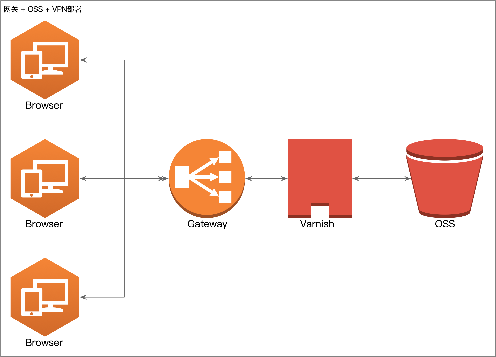
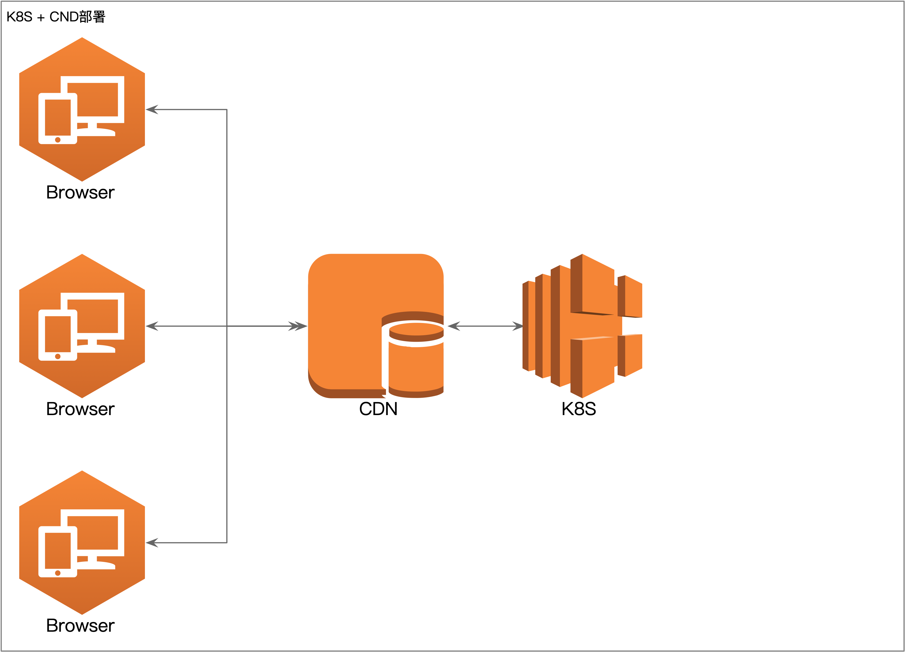

## 一、网关 + OSS + VPN部署

### 1.1 问题
在OSS上，用增量策略，部署前端纯静态资源非常方便，而且稳定性、扩展性都很高。将CDN回源到OSS，可以进一步提升Web应用的性能。

但存在的一个限制是：无法绑定集团的VPN，或者说在CDN上绑定VPN的意义不大——VPN是单一入口IP，CDN是边缘节点，把边缘节点从VPN绕一圈没有意义。对于安全敏感但性能不敏感的Web应用，可以使用OSS + 集团网关（网关绑定VPN）的方式来进行部署。

> 集团VPN只是登陆内网用的，已经下线了公网资源，但原来遗留的公网IP，还有一部分在集团VPN上，得看看他访问的这个公网IP有没有在集团VPN中，如果再的话，加白集团VPN就可以了；但如果集团VPN没有，那只能通过你们自己部署的跳板机登陆了，不能直接登陆的。

### 1.2 说明
1. OSS作为透明的存储，仅仅做文件的存储；
2. 网关作为前台服务器，绑定域名，配置VPN，并将回源地址指向OSS内网域名；
3. 部署Varnish代理缓存服务器后，可以在网关配置缓存策略。




## 二、K8S部署
个人认为，K8S是运维工作的最佳实践，其Health Check、Liveness、滚动发布、自动伸缩容等等都是标准事实的最佳实践。详见[K8S上前端的部署](https://cloud.tal.com/docs/k8s/quick_start/k8s-oss.html)。具体前端的配置脚本如下：

### 2.1 编译脚本
```bash
echo "BUILD START"

cd  /workspace/git-resource
npm i
npm run build

echo "BUILD SUCCESS"
```

### 2.2 Dockerfile
```bash
FROM hub.xesv5.com/standard/nginx:1.20.1-alpine
# FROM行由前端生成，请不要改动

RUN rm /etc/nginx/conf.d/default.conf
COPY ./git-resource/docker-config/default.conf /etc/nginx/conf.d/default.conf
COPY ./git-resource/dist /workspace/frontend
```

### 2.3 Nginx配置
`default.conf`需要放置在项目的`docker-config`目录中。

```nginx
server {
    listen       80;
    server_name  localhost;

    #charset koi8-r;

    access_log /workspace/access_frontend.log;
    error_log  /workspace/error_frontend.log;

    location / {
        add_header Cache-Control no-cache;

        if ($request_uri ~ .*\.(js|css|woff|eot|woff2|ttf|svg|png|jpg|jpeg|gif|ico)$) {
            add_header Cache-Control max-age=315360000;
        }

        alias /workspace/frontend/;
        try_files $uri $uri/ /index.html;
        index  index.html;
    }

    #error_page  404              /404.html;

    # redirect server error pages to the static page /50x.html
    #
    error_page   500 502 503 504  /50x.html;
    location = /50x.html {
        root   /usr/share/nginx/html;
    }

}
```


## 三、K8S + CDN部署
如上“K8S”部署会存在一个问题：部署新的版本后，使用老版本的用户会无法继续使用，因为资源不存在了。解决方法有三个：
1. 使用PWA，参考《性能优化》中的《一、Service Worker》小结；
2. 使用[基于[K8S+OSS]实现的前端静态资源CDN部署](https://cloud.tal.com/docs/k8s/quick_start/k8s-oss.html)；
3. 使用本节中的K8S + CDN部署。

如下图所示，在K8S部署的基础上，添加CDN即可。


备注：未验证，跟吴昊老师口头沟通可行。
