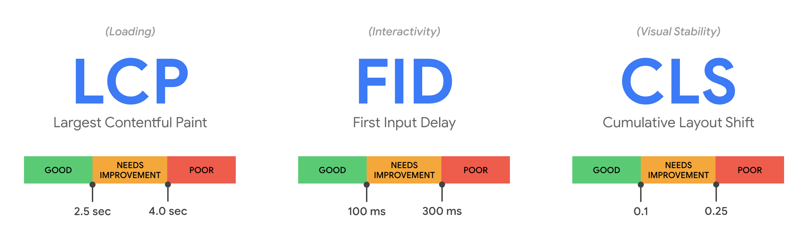

> 若一个产品性能无法量化，则没有预算，也就无法优化。

## 〇、要求
1. 生产/测试环境，75分位，LCP < 1s
2. 对接大前端性能监控平台，或者接入sentry。

## 一、概述

前端项目主要有 Web Page（Landing 页面等）和 Web App两类典型的 Web 产品。两类产品的本质差异是用户使用时间的长短：前者是用户分钟级别完成页面的速览，后者是用户通常用更长时间完成学习、生产等任务。
技术差异的关键在技术的复杂度上：前者一般需要 SSR（Server Side Rendering）、NSR（Native Side Rendering） 来完成单页面的提速，后者以更多的技术工具比如路由、通信等来解耦业务的复杂度。

错误监控是线上运行稳定性的基础设施，在性能监控方面，Web Page 类产品的性能主要依赖于资源加载，加载监控已经可以满足性能监控需求（可用[Web Vitals](https://web.dev/vitals/ )替代）；Web App 类产品的性能监控需要覆盖更长生命周期的运行时监控，核心监控是能否长时间流畅运行，即卡顿情况——抽象为帧率指标。

运行性能的直观反馈是人机交互的延迟，比如视图展现慢、列表滚动卡、按钮点击顿、应用无响应等，基本思考如下：
1. 交互延迟（视觉、触觉、感觉），是软件在硬件和资源上执行的结果，对其现象进行监测以暴露问题，作为性能问题排查的入口；
2. 硬件资源，对软件执行有基本限制，对其监测以证明，搜集产生性能问题的环境数据（包括网络）；
3. 软件算法，可以作为性能问题产生的原因，对其监测以定位，搜集产生性能问题时的上下文以排查解决。

简单总结：性能监控，是通过暴露问题并搜集产生问题的数据（场景）以在软件、资源、环境层面解决问题。

## 二、工具

### 2.1 Web-Vitals——加载性能替换方案
[Web Vitals](https://web.dev/vitals/) 是 Google 面向未来的性能度量重心。Web Vitals 基于更易标准化、更加贴近用户真实感受的原则对指标进行了升级，并在指标之上定义了 Core Web Vitals，开发者只需要聚焦在最核心的三个指标上。

> Largest Contentful Paint (LCP): measures loading performance. To provide a good user experience, LCP should occur within 2.5 seconds of when the page first starts loading.  
> First Input Delay (FID): measures interactivity. To provide a good user experience, pages should have a FID of 100 milliseconds or less.  
> Cumulative Layout Shift (CLS): measures visual stability. To provide a good user experience, pages should maintain a CLS of 0.1. or less.

可集成 GoogleChrome 官方提供的库：[ web-vitals ]( https://github.com/GoogleChrome/web-vitals )，原来的大前端性能监控仅使用数据上报即可。Web Vitals 提供下列 API，归一化计算权重可参考：[Lighthouse performance scoring]( https://web.dev/performance-scoring/#lighthouse-6 )
1. `getCLS()`: Chromium
2. `getFCP()`: Chromium
3. `getFID()`: Chromium, Firefox, Safari, Internet Explorer (with polyfill, see below )
4. `getLCP()`: Chromium
5. `getTTFB()`: Chromium, Firefox, Safari, Internet Explorer

### 2.2 Apdex
[Apdex (Application Performance Index) 应用性能指数](https://support.huaweicloud.com/apm_faq/apm_03_0010.html), 也被称为 满意度。是由 Apdex 联盟开放的用于评估应用性能的工业标准。标准从用户的角度出发，将对应用响应时间的表现，转为用户对于应用性能的可量化为范围为 0 - 1 的满意度评价。

