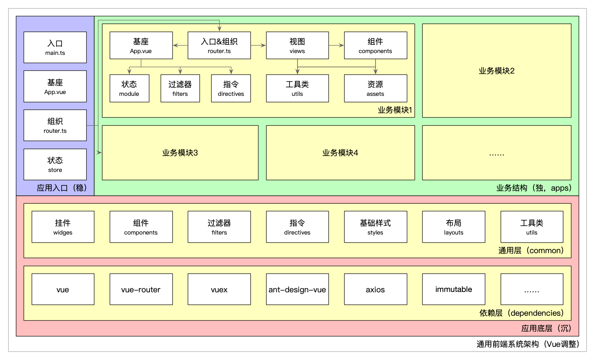
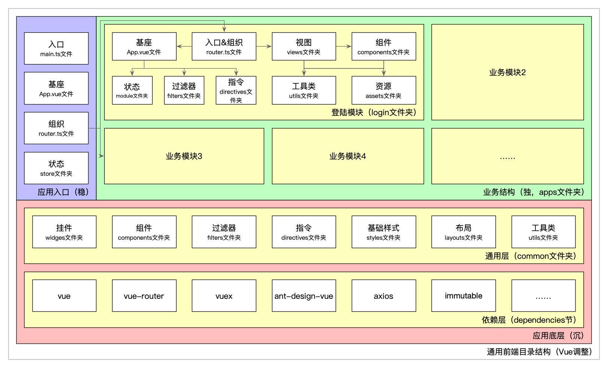

## 一、技术选型

当前阶段基于Vue、Vue Router、iView/Element/Ant Design Vue进行项目的搭建，依赖的三方库统一记录在[公共库清单（包含二、三方库）](./arch-spa-libs.md)中。

## 二、基础设计

通用前端系统架构如下图所示：

### 2.1 应用入口

#### 2.1.1 入口`main.ts`的责任
`main.ts`承担纯粹的入口职责，完成App的设置和驱动，包括以下具体工作：
1. 统一引用全局依赖层，比如Polyfill、UI库的样式等；
2. 统一引用全局通用层，包括过滤器、指令、基础样式；
3. 统一引用并设置全局配置；
4. 统一声明入口驱动代码，比如路由、Store等；
5. 禁止包含其他代码，尤其业务性质的代码。

#### 2.1.2 基座`App.vue`的责任
1. App的整体框架性载体；
2. 如果整体应用简单，可以负责布局层的引用，以简化业务模块中基座的重复设置。

#### 2.1.3 组织`router.ts`的责任
1. App的通用路由设置，比如404等；
2. 统一引入具体业务结构中的业务模块。

#### 2.1.4 状态`store`的责任
1. App的全局通用状态，比如用户信息，Token等；
2. 禁止包含业务模块级别的状态，避免业务模块的状态在全局耦合。

### 2.2 应用底层
1. 应用底层分为依赖层和通用层两层，前者是业界和公司的公共库，后者是整个应用的通用层，这两层都可以分为全局应用部分和按需引用部分两类；
2. 依赖层中公共库统一记录在[公共库清单（包含二、三方库）](./arch-spa-libs.md)中；
3. 依赖层中的全局应用部分，在main中统一引入，便于在子应用中使用；
4. 依赖层中的按需引用部分，在业务模块中按需引入，保持依赖的简单性；
5. 通用层需要重点维护的，牵一发而动全身，单元测试重点保障；
6. 通用层中的过滤器、指令、基础样式是全局应用部分，在main中统一引入，便于在子应用中使用；
7. 通用层中的挂件、组件、布局、工具是按需引用部分，在业务模块中按需引入，保持依赖的简单性。

### 2.3 业务结构
1. 业务模块可以理解为子应用，包含一个或多个页面，其中基座、入口、组织、视图、组件、状态、过滤器、指令、工具类、资源等均组织在一起，便于就近引用和管理。在业务模块入口中独立分包，异步加载；
2. `router.ts`是业务模块级别的入口：
    1. 在模块内负责将视图组织在一起；
    2. 并注册到应用级别路由中。
3. `App.vue`是业务模块级别的底座：
    1. 负责模块级别状态注册、加载、销毁和卸载的完整生命周期；
    2. 负责模块级别过滤器、指令的引入；
4. API Mock只在开发环境引入；
5. 业务模块级别的组件、过滤器、质量、工具类等可按需沉淀到通用层。

### 2.4 强调
1. 如无必要，勿用Vuex；
2. 轻量使用Vuex，优先使用模块级别Vuex，全局Vuex仅共享状态存储而已。

### 2.5 模块化方案
1. 项目内部，基于ES Module（ES6标准规范）进行编码，即内部使用`import/export`语法，可以使用`import()`动态加载；
2. 项目引用，三方库的引用，通过配置转换为标准ES Module形式在内部使用；
3. 项目打包，输出标准ES Module模块（暂时不考虑CommonJS、AMD、IIFE等形式）；
4. 复杂项目，优先推荐采用Independent模式，即在同一个仓库中进行分包处理；如果某模块需要提供给更多的项目使用，则将其单独为独立的源代码库。

## 三、目录规范
目录规范极其重要，是系统架构的载体，目录结构和代码结构需要一一对应，以保持心智模型相匹配，以快速而可靠地找到高层概念的代码实现所在：
1. 纵向上高层入口显而易见；
2. 横向上模块依赖就近使用。

常见的目录规范形式有以模块（代码）类别划分的扁平化，和以业务/功能划分的树形结构。扁平化在小项目（2-3个页面）中比较实用；系统架构本质上是树形结构，树形结构目录在复杂项目中的隔离型和解耦性更好，利于代码的阅读和维护。

如下图，良好的目录结构图和系统结构图保持一致，通用前端目录结构主体上选择树形结构，模块粒度使用扁平结构（避免结构目录过深），如下图所示：

需要避免项目文件夹层级过多，在某些情况下参照产品菜单来创建文件夹可能会出现7级嵌套，不利于维护开发；此时需要跳出原有的思维限制，按照具体项目来建立一级文件夹，避免过深的文件夹层级嵌套，这样也有利于路由的配置简化；通过路径规划设置，让配置更简练，屏蔽请求路径差异。

## 四、命名规范

命名规范的最佳实践如下

### 4.1 文件夹命名规范
1. 文件夹一律采用全小写中杠分隔的形式，例如 `ecs-seahare` 进行命名。

### 4.2 文件命名规范
1. 组件文件一律采用Pascal命名法（大驼峰）的形式，例如 `TogglePassword.vue` 进行命名，以在概念上和组件`类`的抽象保持一致；
2. 非组件文件一律采用Camel命名法（小驼峰）的形式，例如 `config.ts` 进行命名。
3. 避免`index`爆炸，简单组件或视图，直接以命名即可，组件对应的`.js`、`.css`以及`.vue`文件直接并排放置即可，多个组件并排放置即可。

### 4.3 代码命名规范
1. 输出和注册组件一律采用大写驼峰形式，例如`LoginTemplate`；
2. 使用组件时一律采用大写驼峰形式，例如`<LoginTemplate></LoginTemplate>`，和注册保持一致，在形式上和html区分；
3. 在书写 html 时，为区分`iview`自定义的标签和`html`原生标签，需要将`iview`标签写成带有`I`前缀的形式。如：`<IMenuItem></IMenuItem>`；
4. `import`vue文件组件时必须添加`vue`后缀（原因：webpack无法区分同名的`.js`和`.vue`文件，两者会产生不确定随机引用，有可能造成文件入口错误）；
5. `import`频道（子App）内文件用相对路径，频道外文件用绝对路径（`'@/common/utils/request'`）；

## 五、API规范

### 5.1 API接口

1. 所有的API接口字段信息保持一致；
2. 时间统一以毫秒级别的形式进行传递，前端进行对时间数据的处理；
3. API接口信息中不用的字段不应该传递；
4. API接口字段尽量返回数据库原始数据，保持数据的可复用性以及原始性；
5. 尽量减少接口的请求。能复用的请求可以直接复用。最好定义API时候保持API的纯粹性

### 5.2 接口错误处理

一个页面有时可能会涉及到多个接口同时请求，对着这种请求，我们需要对接口信息进行多种情况的判断，避免页面强制刷新带来重复请求

目前考虑到的有`请求中`、`请求成功有数据`、`请求成功无数据`、`请求失败`这四种情况

## 六、其他原则

### 6.1 UI库（iView/Element/Ant Design Vue）原则：
1. 优先用UI库，尽量用同一套UI库。工具类和UI库风格保持一致，并符合UI库的规范。
2. 如果需要进一步调整整体布局，统一修改UI库的样式配置文件（common/styles/custom.less）的方式；
3. 自闭合的标签不要加`/`（`style`除外，Vue中其含义和标准的HTML不完全一样），比如`img`、`input`、`link`、`meta`、`br` 等。
4. 删减用不到的样式
5. 充分使用UI库，做好参与UI库开发或者fork UI库长期维护的准备。
6. 中后台项目，如果项目的UI布局由FE设计，不需要精确到像素，一般情况下优先使用标准的UI控件，以统一编码和形式。

### 6.2 Request

#### 原则
使用代理磨平开发、测试和生产环境的差异，直接使用最终的Path发起请求；

### 6.3 时间处理规范

1. 时间一律使用luxon来进行处理
