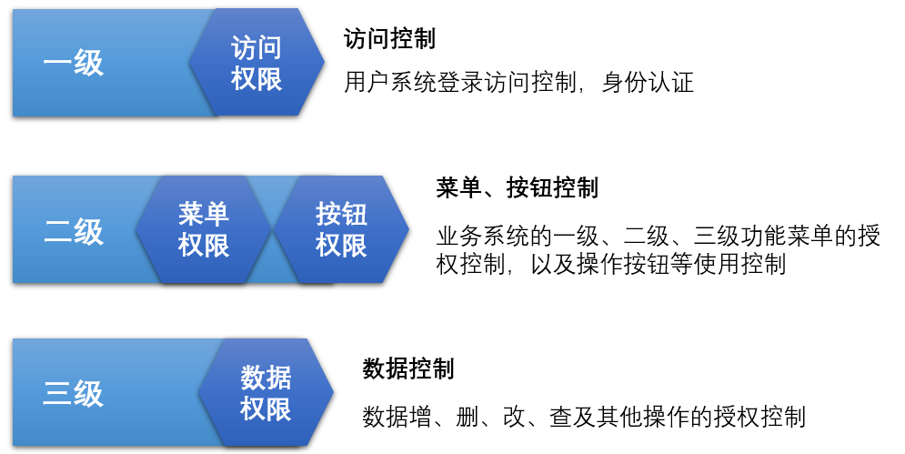

## 一、权限概述
权限问题可以转换为由 Who、What、How 构成的访问权限三元组，权限认证的过程即是对“Who 是否可以对 What 进行 How 的访问操作？”这个逻辑表达式求解的过程。
1. Who：权限的拥有者或主体；
2. What：对象；
3. How：具体的权限（Privilege，正向授权与负向授权）。

### 1.1 授权类型的分类
一般情况下，我们将整体授权类型划分为三级，依据不同等级的授权，来控制授权的最小的颗粒度。
1. 一级权限：应用访问权限，用户可以访问哪些应用；
2. 二级权限：菜单访问权限，用户可以访问某个应用中的哪些菜单和按钮；
3. 三级权限：数据访问权限，用户可以访问某个菜单下的哪些数据。

