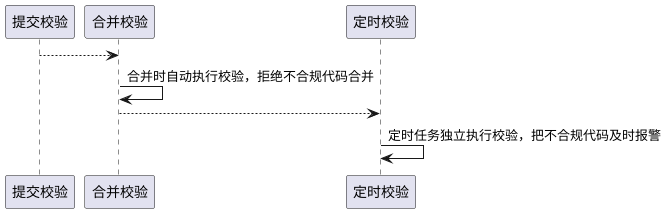

## 〇、持续集成概况

| 序号 | 环节     | 修复成本 | 说明 |
|:----:|:--------:|:--------:|------|
| 1    | 合并环节 | 高 | 代码合并时关键修改，不让低质量代码流入仓库 |
| 2    | 定时环节 | 最高 | 代码合并后独立把关，代码质量报警和救赎 |


## 一、前言
GitLab作为整体的工作台。GitLab-CI就是一套配合GitLab使用的持续集成系统，在GitLab8.0以后的版本是默认集成了GitLab-CI并且默认启用的。其基本理念是：**Anything is Code**。

>持续集成是一种软件开发实践，即团队开发成员经常集成他们的工作，通常每个成员每天至少集成一次，也就意味着每天可能会发生多次集成。每次集成都通过自动化的构建（包括编译，发布，自动化测试)来验证，从而尽快地发现集成错误。许多团队发现这个过程可以大大减少集成的问题，让团队能够更快的开发内聚的软件。

## 二、CI流程

当我们push代码到远程分支时，会触发GitLab-CI：

1. 执行自动化脚本，构建并检测项目
2. 若检测通过，则可以进行review；若未通过，则修改后重新push，再次执行第一步
3. 若review通过后，则merge代码，会再次执行自动化脚本，检测项目并进行交付


### 2.1 .gitlab-ci.yml

要使用GitLab-CI，首先需要在根目录下添加`.gitlab-ci.yml`，用来记录CI需要执行的操作。当触发CI操作时，GitLab-CI会读取`.gitlab-ci.yml`中的信息。

>这是一个YAML文件，因此您必须格外注意缩进。始终使用空格，不要使用制表符。

下面介绍一下`.gitlab-ci.yml`的主要元素。

### 2.2 Job

Job是`.gitlab-ci.yml`文件的最基本元素。

* Job定义了约束，即什么条件下执行
* Job为具有任意名称的顶级元素(需要避开[保留字](https://docs.gitlab.com/ee/ci/yaml/README.html#unavailable-names-for-jobs))，并且至少有一个`script`子语句
* 不限制Job的数量
```plain
job1:
  script: "execute-script-for-job1" // 单个子语句
job2:
  script: // 多个子语句
    - bundle exec rspeca
    - bundle exec rspecb
```
每个Job在Runner(即GitLab-Runner，下文有介绍)中**彼此独立运行**，多个Job形成了CI的Pipeline配置步骤。
### 2.3 关键字

除了`script`是Job的唯一必需关键字外，Job还有其他关键字：

* environment 用于定义Job部署到指定环境
* image 用于指定用于Job的Docker映像
* stage 用于定义Job的阶段，和全局关键字`stages`配合使用，可以在特定环境下并行执行相同`stage`的Job
* timeout 用于设置Job的超时时长
* rules 用于Job进行判断。其中的`if`属性可以根据变量`$CI_PIPELINE_SOURCE`的值来进行判断
* 。。。

更多的关键字可以查询[这里](https://docs.gitlab.com/ee/ci/yaml/README.html#job-keywords)。

### 2.4 全局关键字

除了在每个Job中定义关键字，也可以定义全局关键字。

* stages 用于定义包含Job的所有阶段，其中元素的顺序决定了对应Job的执行顺序
```plain
stages:
  - build
  - test
ob 1:
  stage: build
  script: make build dependencies
job 2:
  stage: build
  script: make build artifacts
job 3:
  stage: test
  script: make test
```
* 也可以使用`default`来定义一些默认值，针对所有Job生效。
```plain
default:
  image: ruby:2.5
rspec:
  script: bundle exec rspec
rspec 2.6:
  image: ruby:2.6 // 覆盖了默认值ruby:2.5
  script: bundle exec rspec
```
* 还有其他的全局关键字可以查看[这里](https://docs.gitlab.com/ee/ci/yaml/README.html#global-keywords)

## 三、GitLab-Runner

GitLab-Runner是配合Gitlab-CI使用的，是一个用来执行软件集成脚本的东西，可以是虚拟机，VPS，裸机，Docker容器，甚至是一组容器。

当GitLab中有代码修改时(比如push代码)，GitLab会通知GitLab-CI。这时GitLab-CI会找到并通知关联的GitLab-Runner，GitLab-Runner则会把项目代码下载到本地并执行预先设计好的脚本。

GitLab-Runner有两种类型：**共享型(Shared Runner)和私有型(Specific Runner)**。

* Shared Runner 需要管理员安装配置，所有项目共用，但是最好在yml文件中设置不同docker 镜像(image)用以区分
* Specific Runner 可以有项目权限的人员安装配置，每个项目私有

### 3.1 安装GitLab-Runner

在使用GitLab-Runner前，我们需要先进行安装。GitLab-Runner有三种安装方法：使用Docker，手动下载二进制文件或使用rpm/deb软件包的存储库。

这里简单描述本机GitLab-Runner安装：

*注：由于项目中使用的是Window10-64位作为测试服务器，所以这里的私有型GitLab-Runner安装，及下面的注册等内容都是基于该服务器，若使用其他环境请参考*[官网](https://docs.gitlab.com/runner/install/)*。*

1. 在系统中的某个位置创建一个文件夹，例如：`D:\GitLab-Runner`。
2. 下载exe[文件](https://gitlab-runner-downloads.s3.amazonaws.com/latest/binaries/gitlab-runner-windows-amd64.exe)(x86可下载[这个](https://gitlab-runner-downloads.s3.amazonaws.com/latest/binaries/gitlab-runner-windows-386.exe))
3. 将下载的`gitlab-runner-windows-amd64.exe`文件**重命名为**`gitlab-runner.exe`，并移动到`D:\GitLab-Runner`中

### 3.2 注册GitLab-Runner

这时准备工作就已经完成了，需要开始GitLab-Runner的注册。而GitLab-Runner的注册需要先在`GitLab项目-设置-CI/CD-Runner`中获取gitlab-ci coordinator URL和token：


获取相关信息后，就可以在`cmd`中进行注册执行了：

1. 打开`D:\GitLab-Runner`，然后输入`gitlab-runner.exe register`，并回车
2. 输入gitlab-ci coordinator URL，用以找到对应的Gitlab
3. 输入token，用以注册Runner
4. 输入Runner的描述信息
5. 输入Runner的tag，以逗号分隔
6. 输入Runner的执行场景，这里我选的是sell

当然，具体配置什么按照各自的项目来确定，可以参考[官网](https://docs.gitlab.com/runner/register/)。


当注册完毕后，你可以在`D:\GitLab-Runner`里发现`config.tom`文件，该文件是Runner的配置文件。

### 3.3 启动服务

你可以直接启动Runner服务：

```plain
./gitlab-runner.exe run
```
你也可以将Runner设置为[系统服务](https://docs.gitlab.com/runner/configuration/init.html)：
```plain
// 使用当前用户帐户的有效密码
./gitlab-runner.exe install --user ".\ENTER-YOUR-USERNAME" --password "ENTER-YOUR-PASSWORD"
// 启动服务
./gitlab-runner.exe start
// 暂停服务
./gitlab-runner.exe stop
```
服务启动后，可以在`GitLab项目-设置-CI/CD-Runner`中查看到当前Runner的状态：


### 3.4 pipelines

当我们配置好Runner后，就可以在分支中添加`.gitlab-ci.yml`进行简单测试：

```plain
// .gitlab-ci.yml
build:
  tags:
    - test-master
  script:
    - npm install
    - npm run build
```
我们将修改后的代码推送到远程gitlab，就可以在`CI/CD-pipelines`中看见当前CI的执行状态：


点击pipelines中的状态，就可以查看所有Job的执行状态：


点击Job，也可以查看Job的详细流程：


## 四、总结

使用Gitlab对代码进行版本管理时，可以使用Gitlab-CI进行持续集成。

在使用Gitlab-CI前，需要完成`.gitlab-ci.yml`和Gitlab-Runner的配置。在push、merge等操作时，触发持续集成，可以在pipelines中查看进行状态。

### 4.1 参考.gitlab-ci.yml

注：公司的gitlab版本应该不是很高，`default:`全局默认值无法使用。

```plain
cache:
paths:
- node_modules
policy: pull

stages:
- build
- test
- deploy

build:
stage: build
tags:
- upm
script:
- echo $CI_MERGE_REQUEST_ID
- echo $CI_COMMIT_REF_NAME
- npm cache clean --force
- npm install
- echo 'start test'
- npm run lint:eslint
- npm run lint:style
- echo 'deploy_success'
- npm run ci-yach -- --secret $CI_YACH_SECRET --token $CI_YACH_TOKEN --branch $CI_COMMIT_REF_NAME --commit $CI_COMMIT_MESSAGE
cache:
policy: push

deploy_failure:
stage: deploy
tags:
- upm
script:
- echo 'deploy_failure'
- npm run ci-yach -- --secret $CI_YACH_SECRET --token $CI_YACH_TOKEN --err --branch $CI_COMMIT_REF_NAME --commit $CI_COMMIT_MESSAGE
when: on_fail
```
## 五、参考

* [Gitlab .gitlab-ci.yml --官网](https://docs.gitlab.com/ce/ci/yaml/README.html)
* [Gitlab CI 使用高级技巧](https://www.jianshu.com/p/3c0cbb6c2936)
* [基于 GitLab CI 的前端工程CI/CD实践](https://juejin.im/post/6844903869739171848)


