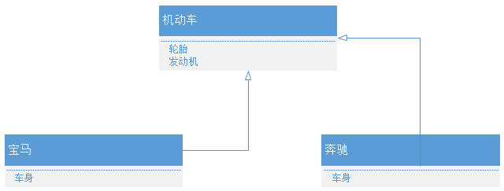
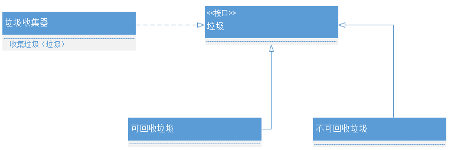

## 一、代码评审的价值

最核心的价值如下：
* 尽早发现问题；
* 传递交流经验；
* 交叉熟悉业务；
* 促进成员自律；
* 提高代码质量。

> Google的代码评审是做的很好的，可以说是谷歌保持代码高质量最有效的手段之一。Google的代码评审非常严格，多一个空行，多一个空格，注释有拼错的单词，变量命名的不够好，都被指出来要求修改。而且，所有的项目都要求代码评审。


## 二、代码评审的做法

### 1、适用于申请者的建议

1. 在GitLab上提交Merge Request（MR）后，将MR的链接发给代码审核者，申请对方进行Review。
2. 每次提交代码（`git commit`）之前，必须先Review（`git diff`）下要提交的内容，避免错误提交。这样可以避免低级错误，如把一些本不该提交的内容提交至代码仓库中，避免浪费Review者的时间。
3. 申请代码评审之前，必须自己先测试一遍所提交的代码。
4. 尽量避免单个MR粒度过大（建议不要超过3个文件或500行代码），防止让Review者一次负担过重，影响Review效果。


### 2、适用于评审者的建议

1. Review通过，在GitLab上点赞确认。
2. Review Comment（评论）遵循如下规范：<br />
    在做代码评审时，需要对检查出有问题的代码行添加评论并进行分级，即打上不同的前缀，比如说：
    * [blocker]：在评论前面加上一个blocker标记，表示这个代码行的问题必须要修改。
    * [optional]：在评论前面加上一个[optional]标记，表示这个代码行的问题可改可不改。
    * [question]：在评论前面加上一个[question]标记，表示对这个代码行不理解，有问题需要问，代码提交者需要针对问题进行回复澄清或者线下沟通。

    类似这样的分级可以帮助代码提交者直观了解Review结果，提高Review效率。

3. 如果看不懂要Review的代码，必须予以打回或进行线下沟通，待修改合格后再继续Review。<br />
    Review者看不懂代码，表明代码可读性存在问题，可读性/注释不够。<br />
    可读性好，则后期维护成本低、线上bug容易排查、新人容易熟悉代码、老人离职时代码容易接手、代码足够简单、出错可能性小、代码的组织架构合理。


### 3、适用于申请者和评审者的建议

1. 对于靠评论沟通不清时，或有异议时，应当进行线下沟通——线下沟通通常更高效。
2. 保持正面积极的态度，认真对待<br />
    双方都需要一种积极向上的正面的态度，认真对待，避免走过场。<br />
    申请者需要能够虚心接受别人的建议，因为别人的建议是为了让你做得更好，肯给你提建议的人，值得珍视，必要时进行一些重构；<br />
    评审者也需要以一种成就伙伴和为项目质量负责的态度向作者提出必要的意见，为自己的点赞负责。

## 三、代码评审的清单

### 1、模块结构

1. 设计/划分是否清晰、合理
2. 是否尽可能地遵循了**SOLID**原则

| 原则| 名称         | 说明        |
|:---:|:------------:|-------------|
| SRP | 单一责任原则 | 让当需要修改某个类的时候，原因有且只有一个（THERE SHOULD NEVER BE MORE THAN ONE REASON FOR A CLASS TO CHANGE）。换句话说就是让一个类只承担一种类型的责任，当这个类需要承当其他类型的责任的时候，就需要分解这个类。例如，餐厅服务员应该把订单给厨师去做，而不是服务员又要订单又要炒菜。<br />  |
| OCP | 开放封闭原则 | 软件实体应该是可扩展，而不可修改的——任何模块都是可完成的。也就是说，对扩展是开放的，而对修改是封闭的。意为一个类独立之后就不应该去修改它，而是以扩展的方式适应新需求。例如一开始做了普通计算器程序，突然添加新需求，要再做一个程序员计算器，这时不应该修改普通计算器内部，应该使用面向接口编程，组合实现扩展。<br />  |
| LSP | 里氏替换原则 | 一个子类的实例应该能够替换任何其超类的实例。子类可以扩展父类的功能，但不能改变父类原有的功能。例如，机动车必须有轮胎和发动机，子类宝马和奔驰不应该改写没轮胎或者没发动机。<br />  |
| ISP | 接口隔离原则 | 不能强迫用户去依赖那些他们不使用的接口。它应该知道得越少越好。例如，电话接口只约束接电话和挂电话，不需要让依赖者知道还有通讯录。换句话说，使用多个专门的接口比使用单一的总接口总要好。<br />  |
| DIP | 依赖倒置原则 | 指的是高级模块不应该依赖低级模块，二者都应该依赖于抽象。抽象不能依赖细节，细节要依赖抽象。比如类A内有类B对象，称为类A依赖类B，但是不应该这样做，而是选择类A去依赖类B的抽象。例如垃圾收集器不应该依赖于可回收垃圾、不可回收垃圾，而应该依赖于它们的抽象，即垃圾的抽象接口。<br /> |


### 2、三方依赖

被引入的三方库版本和star数是否过低，单元测试是否完备，比如版本为0.x.x的要小心，`star数 < 2000`的要小心审查一下。


### 3、代码规范

1. 分支命名应符合规范
2. 编码应符合代码规范


### 4、代码内容

#### 4.1 正确性
1. 语法正确，代码的语法是否正确
2. 语义正确，是否符合语义化的要求
3. 逻辑正确，代码逻辑是否正确
4. 结构正确，有无死循环、无穷递归
5. 赋值正确，有无本该是动态的内容，却被错误地写死成静态值的情况


#### 4.2 安全性
1. 是否存在XSS漏洞<br />
    例如`input`输入内容直接渲染到DOM或img src属性渲染，若为`<script></script>`，渲染的DOM会直接执行，尽量采用特殊字符转义方式，处理如`<>`（尖括号）、`"`（双引号）、 `'`（单引号）、`%`（百分号）、`;`（分号）、`()`（括号）、`&`（& 符号）、`+`（加号）等
2. 是否存在CSRF漏洞
3. 是否存在SQL注入的风险
4. 是否做了必要的身份验证和鉴权处理
5. 是否非法保存了用户的敏感信息，如密码、信用卡信息等
6. 是否有防暴力破解的措施


#### 4.3 健壮性
1. 考虑代码逻辑有没有覆盖到边界情况（如数组边界溢出、被零除、值越界等），是否有逻辑漏洞
2. 是否进行了必要的合法性校验和异常处理：
    1. 对外部传入的输入，要做合法性校验
    2. 使用的外部对象要做是否存在的校验<br />
        比如，读取的文件夹存不存在，要存往的目录存不存在，是否有同名文件，要播放的视频文件存不存在，等等
    3. 对于某对象使用.forEach()、.split()等时，得保证该对象确实存在对应的方法，否则会报错
    4. 判空：形如a.b这样的引用，应关注是否会出现a为undefined的情况
    5. 对于请求的返回异常、回调异常、代码执行异常等异常情况，要做异常处理
    6. 是否有加上必要的try catch

#### 4.4 可维护性

##### 第一，提高可读性
1. 应有必要的注释，让代码清晰明白，便于后续维护
    1. 文件开头、函数开头应有注释
    2. 函数入参应有注释
    3. 对于不易于理解的变量，应注释其含义及用途
    4. 对于不太好理解的逻辑，应该注释了为什么这么写，或者优化为容易理解的等价逻辑
2. 单个函数体是否代码行数过多（最好不超过80行）
3. 单个文件行数是否过多（最多不超过500行）
4. if else嵌套层级是否过多（别超过3层）
5. 函数参数是否过多（别超过3个）
6. 命名要规范易懂

##### 第二，减少代码冗余
1. 关注是否存在本应提取的重复代码，需遵循DRY（Do not Repeat Yourself）原则：同一代码不应该重复两次以上。
2. 无用的代码需要清除
3. 是否提交了一些本不应提交到git仓库的文件

##### 第三，避免全局污染
1. 避免出现未声明的变量直接使用的情况
2. 尽量避免全局变量、函数的使用
3. 禁止覆盖JavaScript原型链上自带的方法
4. 尽量避免CSS样式的全局覆盖

#### 第四，关注耦合情况及可复用性。


### 5、代码性能

1. 关注循环体内的代码是否存在性能问题，比如频繁IO
2. 关注是否会频繁触发渲染
3. 关注是否会存在线程阻塞
4. 关注边界情况下是否会出现严重的性能问题，考虑最差的情况
5. 关注算法是否不够优化，算法复杂度如何
6. 是否存在内存泄露的风险
    1. `setTimeout`是否有被`clearTimeout`
    2. `setInterval`是否有被`clearInterval`
    3. 不再使用的对象是否被设置成`null`
    4. Vue.js `beforeDestroy`钩子中是否有对一些绑定的事件进行解绑。


### 6、可测试性
1. 关注代码的可测试性

### 7、坏味道
参考《代码整洁之道》所列出的坏味道和建议

#### 第一，函数的坏味道
F1：过多的参数<br />
函数的参数量应该尽可能少。

F2：输出参数<br />
读者期望的参数应该用于输入而非输出。

F3：标识参数<br />
布尔值参数大声宣告函数做了不止一件事。它们令人迷惑，应该消灭掉。

F4：死函数<br />
永不被调用的方法应该丢弃。


#### 第二，注释的坏味道
C1：不恰当的信息<br />
让注释传达本该更好地在源代码控制系统、问题追踪系统或任何其他记录系统中保存的信息，是不恰当的。注释只应该描述有关代码和设计的技术性信息。（不应用注释来表明源代码作者，修改时间等信息）

C2：废弃的注释<br />
过时、无关或不正确的注释就是废弃的注释。

C3：冗余注释<br />
如果注释描述的是某种充分自我描述了的东西，那么注释就是多余的。注释应该谈及代码自身没提到的东西。

C4：糟糕的注释<br />
值得编写的注释，也值得好好写。如果要编写一条注释，就花时间保证写出最好的注释。

C5：注释掉的代码<br />
删掉注释掉的代码，源代码控制系统会保存它。


#### 第三，环境的坏味道
E1：需要多步才能实现的构建<br />
构建系统应该是单步的小操作。

E2：需要多步才能做到的测试<br />
单个指令就可以运行全部测试。

#### 第四，一般性问题的坏味道
G1：一个源文件中存在多种语言<br />
尽力减少源文件中额外语言的数量和范围。

G2：明显的行为未被实现<br />
遵循“最小惊异原则”（The Principle of Least Surprise），函数或类应该实现其他程序员有理由期待的行为。

G3：不正确的边界行为<br />
别依赖直觉。探索每种边界条件，并编写测试。

G4：忽视安全<br />
忽视安全相当危险。关闭某些编译器警告（或者全部警告）可能有助于构建成功，但也存在陷于无穷无尽的调试的风险。

G5：重复<br />
每次看到重复代码，都代表遗漏了抽象。重复的代码可能成为子程序或干脆是另一个类。

G6：在错误的抽象层级上的代码<br />
创建分离较高层级一般性概念与较低层级细节概念的抽象模型。

G7：基类依赖于派生类<br />
将概念分解到基类和派生类的最普遍的原因是较高层级基类概念可以不依赖于较低层级派生类概念。

G8：信息过多<br />
尽力保持接口紧凑。通过限制信息来控制耦合度。

G9：死代码<br />
死代码就是不执行的代码。将它从系统中删除掉。

G10：垂直分隔<br />
变量和函数应该在靠近被使用的地方定义。

G11：前后不一致<br />
从一而终。这可以追溯到最小惊异原则。小心选择约定，一旦选中，就小心持续遵循。

G12：混淆视听<br />
没有实现的默认构造器，没有用到的变量，从不调用的函数，没有信息量的注释等等，这些都是应该移除的废物。

G13：人为耦合<br />
人为耦合是指两个没有直接目的之间的模块的耦合。其根源是将变量、常量或函数不恰当地放在临时方便的位置。这是种漫不经心的偷懒行为。

G14：特性依恋<br />
类的方法只应该对其所属类中的变量和函数感兴趣，不该垂青其它类中的变量和函数。

G15：选择算子参数<br />
选择算子参数只是一种避免把大函数切分为多个小函数的偷懒做法。使用多个函数，通常优于向单个函数传递某些代码来选择函数行为。

G16：晦涩的意图<br />
代码要尽可能具有表达力。联排表达式，匈牙利语标记法和魔术数都遮蔽了作者的意图。

G17：位置错误的权责<br />
最小惊异原则作用，代码应该放在读者自然而然期待它所在的地方。

G18：不恰当的静态方法<br />
如果的确需要静态函数，确保没机会打算让它有多态行为。

G19：使用解释性变量<br />
把计算过程打散成一系列良好命名的中间值，不透明的模块就会突然变得透明。

#### 第五，命名的建议
N1：采用描述性名称<br />
不要太快取名。确认名称具有描述性。记住，事物的意义随着软件的演化而变化，所以，要经常性地重新估量名称是否恰当。

这不仅是一条“感觉良好式”建议。软件中的名称对于软件可读性有90%的作用。花时间明智地取名，保持名称有关。名称太重要了，不要随意对待。

N2：名称应与抽象层级相符<br />
不要取沟通实现的名称；取反映类或函数抽象层级的名称。

N3：尽可能使用标准命名法<br />
如果名称基于既存约定或用法，就比较易于理解。具有与项目有关的特定意义的名称用得越多，读者就越容易明白你的代码是做什么的。

N4：无歧义的名称<br />
选用不会混淆函数或变量意义的名称。

N5：为较大作用范围选用较长名称<br />
名称的长度应与作用范围的广泛度相关。

N6：避免编码<br />
不应在名称中包括类型或作用范围信息。在如今的开发环境中，m_或f之类前缀完全无用。类似vis_（表示图形系统）之类的项目或子系统名称也属多余。

当今的开发环境不用纠缠于名称也能提供这些信息。不要用匈牙利语命名法污染你的名称。

N7：名称应该说明副作用<br />
名称应该说明函数、变量或类的一切信息。不要用名称掩蔽副作用。不要用简单的动词来描述做了不止一个简单动作的函数。

#### 第六，测试的建议

T1：测试不足<br />
只要还有没被测试探测过的条件，或是还有没被验证过的计算，测试就还不够。

T2：使用覆盖率工具<br />
覆盖率工具能汇报你测试策略中的缺口。使用覆盖率工具能更容易地找到测试不足的模块、类和函数。

T3：别略过小测试<br />
小测试易于编写，其文档上的价值高于编写成本。

T4：被忽略的测试就是对不确定事物的疑问<br />
有时会因为需求不明而不能确定某个行为细节。可以用注释掉的测试来表达我们对于需求的疑问。

T5：测试边界条件<br />
特别注意测试边界条件。算法的中间部分正确但边界判断错误的情形很常见。

T6：全面测试相近的缺陷<br />
缺陷趋向于扎堆。在某个函数中发现一个缺陷时，最好全面测试那个函数。

T7：测试失败的模式有启发性<br />
有时可以通过找到测试用例失败的模式来诊断问题所在。这也是尽可能编写足够完整的测试用例的理由之一。

T8：测试覆盖率的模式有启发性<br />
查看被或未被已通过的测试执行的代码，往往能发现失败的测试为何失败的线索。

T9：测试应该快速<br />
慢速的测试是不会被运行的测试。时间一紧，较慢的测试就会被摘掉。

#### 第七，一般性问题的建议
G20：函数名称应该表达其行为（即应该望名知意）<br />
如果必须查看函数的实现（或文档）才知道它是做什么的，就该换个更好的函数名，或者重新安排功能代码，放到有较好名称的函数中。

G21：理解算法<br />
了解代码如何工作与了解算法是否按需要执行是不一样的。不确定算法是否恰当司空见惯，而不确定代码做什么却是一种懒惰行为。

G22：把逻辑依赖改为物理依赖<br />
如果某个模块依赖于另一个模块，依赖就该是物理上的而不是逻辑上的。依赖者模块不应该对被依赖者模块有假定（逻辑依赖）。它应当明确的询问后者全部信息。

G23：用多态替代If/Else或Switch/Case<br />
对于给定的选择类型，不应有多于一个switch语句。在那个switch语句中的多个case，必须创建多态对象，取代系统中其他类似switch语句。

G24：遵循标准约定<br />
每个团队都应遵循基于通用行业规范的一套编码标准。团队不应用文档描述这些约定，因为代码本身提供了范例。

G25：用命名常量替代魔术数<br />
在代码中出现原始形态数字通常来说是坏现象。应该用良好命名的常量来隐藏它。

G26：准确<br />
代码中的含糊和不准确要么是意见不同的结果，要么源于懒惰。无论原因是什么，都要消除。

G27：结构甚于约定<br />
坚守结构基于约定的设计决策。命名约定很好，但却次于强制性的结构。

G28：封装条件<br />
如果没有if或while语句的上下文，布尔逻辑就难以理解。应该把解释了条件意图的函数抽离出来。

G29：避免否定性条件<br />
尽可能将条件表示为肯定形式。

G30：函数只该做一件事<br />
函数做了不只一件事时，应该转换为多个更小的函数，每个只做一件事。

G31：掩蔽时序耦合<br />
常常有必要使用时序耦合，但你不应该掩蔽它。排列函数参数，好让它们被调用的次序显而易见。

G32：别随意<br />
构建代码需要理由，而且理由应与代码结构相契合。如果结构显得太随意，其他人就会想修改它。如果结构自始至终保持一致，其他人就会使用它，并且遵循其约定。

G33：封装边界条件<br />
边界条件难以追踪。把处理边界条件的代码集中到一处，不要散落于代码中。

G34：函数应该只在一个抽象层级上<br />
函数中的语句应该在同一抽象层级上，该层级应该是函数名所示操作的下一层。这可能是最难理解和遵循的启发。尽管概念足够直白，人们还是很容易混淆抽象层级。

G35：在较高层级放置可配置数据<br />
如果你有个已知并该在较高抽象层级的默认常量或配置值，不要将它埋藏到较低层级的函数中。

G36：避免传递浏览<br />
通常我们不想让某个模块了解太多其协作者的信息。如果A与B协作，B与C协作，我们不想让使用A的模块了解C的信息，如下坏味道代码：
```javascript
a.getB().getC().doSomething()
```

而应该让直接协作者提供所有的全部服务。不必逛遍系统的对象全图，如下优化代码：
```javascript
myCollaborator.doSomething()
```


## 四、参考
1. [是否要做Code Review？与BAT资深架构师争论之后的思考-王争](https://juejin.im/post/6844903805767647245)
2. [Code Review最佳实践-宝玉](https://www.cnblogs.com/dotey/p/11216430.html)
3. 《代码整洁之道》（Robert C.Martin，人民邮电出版社，2010》

