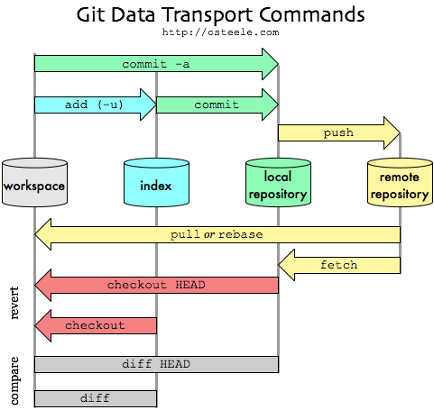
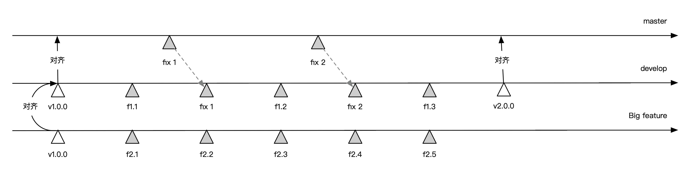
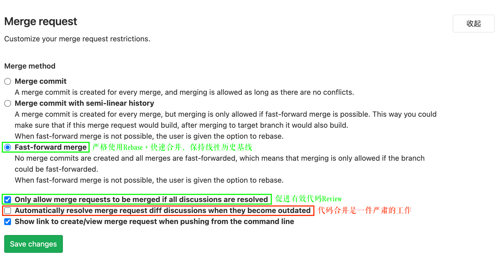

## 〇、Git 简介

### 0.1 Git 解析
Git工作区、暂存区、本地仓库、远程仓库，关系示意图如下：


### 0.2 rebase vs merge
rebase 线性历史记录，便于CI/CD的自动化。
rebase 会更改commit的hash(即commit id), 因为rebase做的事情是 apply change。因为会改掉commit id,那就会有很多要注意的问题，比如两个人用同一个feature分支，都rebase develop分支的话可能会出现问题。


## 一、分支规范

通常情况下，采用Git双分支开发模型，简化源代码的管理：
1. `master`分支，和生产环境最新版本的正式代码对齐，是最新Tag的别名；
2. `develop`分支，开发环境的分支，用于合并开发代码，和测试环境的提测，测试通过后和master对齐。
3. `master`中hotfix之后，`develop`需要执行`rebase`操作和`master`对齐。

示意图如下所示：


建议在GitLab中的源码库做如下设置：
1. 合并设置，在“设置 -> 通用 -> Merge Request”中勾选如下三项，如下图所示：
    1. Fast-forward merge（快速合并，严格使用Rebase + 快速合并，保持线性历史基线）；
    2. Only allow merge requests to be merged if all discussions are resolved（有效Review，当且仅当代码评论解决完成后，再合并代码）；
    3. Show link to create/view merge request when pushing from the command line（严肃合并，仅由Git仓库的Owner执行代码合并）。
  
2. 权限设置，在“设置 -> 仓库 -> Protected Branches”中，把“master”和“develop”两个分支的权限设置为“Maintainers”。


### 1.1 Feat开发流程
1. 签出master分支，`git checkout master`；
2. 更新master分支，`git pull origin master`；
3. 签出Feat开发分支：`git checkout -b feat-audio-20200712`，每个Feat做一个分支；
4. 创建MR（目标develop分支） & 代码复审申请；
5. 复审通过后点赞；
6. 由Maintainer合并到develop分支；

### 1.2 HotFix流程
1. 签出master分支，`git checkout master`；
2. 更新master分支，`git pull origin master`；
3. 签出HotFix分支：`git checkout -b hotfix-audio-20200720`，每个HotFix做一个分支；
4. 开发完成后，3步提交法（`git fetch`，`git rebase origin/master`，`git push origin hotfix-audio-20200720`）提交；
5. 创建MR（目标master分支） & 代码复审申请；
6. 复审通过后点赞；
7. 由Maintainer合并到master分支；
8. 上线后develop分支和master分支对齐，并打版本标签（版本标签遵循[版本规范](./spec-version.md)）。


### 1.3 分支命名规范

Feat开发流程和HotFix流程中涉及到两种分支如下：
1. Feat开发分支：用于正常迭代的功能开发和迭代开发阶段的Bug修复，一般跟拆分的最小子任务对齐，比如：feat-audio-20200712。
2. HotFix分支：用于线上Bug紧急修复，比如：hotfix-audio-20200720。

两种分支命名格式为：
```plain
<type>-<description>-<createTime>
```

`<type>`、`<description>`、`<createTime>`三部分之间用连接符（中横线，减号，`-`）连接，description内部多个单词之间用连接号（-）连接。

| 类型            | 格式                   |  说明                                  |
| --------------- | ---------------------- | -------------------------------------- |
| `<type>`        | `feat` <br /> `hotfix` |  feat，表示功能开发分支，feature的简写 <br /> hotfix，表示紧急修复分支 |
| `<description>` | `audio`             | 描述，分支中要开发的功能 |
| `<createTime>`  | `20200712`             | 创建时间，年月日的8位格式 |


## 二、提交规范

提交信息是源码库中记录历史变化的关键信息，[Angular commit message规范](https://github.com/angular/angular/blob/master/CONTRIBUTING.md#commit)是业界使用的提交规范鼻祖，本文选择扩展后的[@commitlint/config-angular](https://github.com/conventional-changelog/commitlint/tree/master/@commitlint/config-angular)规范。

可进一步参考[Git Commit Message Convention](https://github.com/vuejs/vue/blob/dev/.github/COMMIT_CONVENTION.md)和[Commit message 和 Change log 编写指南](http://www.ruanyifeng.com/blog/2016/01/commit_message_change_log.html)进行学习。


### 2.1 规范说明

基本格式如下：
```plain
<type>(<scope>): <subject> // 必填, 描述主要修改类型和内容。注意冒号后面有空格
<BLANK LINE>
<body> // 描述为什么修改, 做了什么样的修改, 以及开发的思路等等
<BLANK LINE>
<footer> // 放 Breaking Changes 或 Closed Issues
```

| 字段        | 必填 | 说明 |
| ----------- |:----:|------|
| `<type>`    | 是   | 提交类型，主要有以下几种：<br />1. `feat`，新功能开发<br />2. `fix`，Bug修复<br />3. `refactor`，重构（refactoring production code）<br />4. `style`，代码排版格式修改，比如行尾添加分号等<br />5. `docs`，文档修改<br />6. `build`，构建流程或依赖管理等修复<br />7. `ci`，ci相关的修改<br />8. `test`，测试用例补充、修改或重构<br />9. `perf`，性能优化<br />10. `revert`，回滚<br />11. `chore`，杂务，对外部用户不可见的工具、配置等的修改，如修改.gitignore |
| `<scope>`   | 否   | 提交影响的范围, 比如: route, component, utils, build等。如果涉及修改多个scope，可以用*号代替 |
| `<subject>` | 是   | 提交目的的简短描述：<br />1. 不超过50个字符<br />2. 以动词开头，使用第一人称现在时，比如change，而不是changed或changes<br />3. 第一个字母小写<br />4. 结尾不加句号（.） |
| `<body>`    | 否   | 提交的具体修改内容, 可以分为多行，每行达到72字符进行换行 |
| `<footer>`  | 否   | 备注信息：<br />1. 不兼容变动：如果当前代码与上一个版本不兼容，则 Footer 部分以BREAKING CHANGE开头，后面是对变动的描述、以及变动理由和迁移方法。<br />2. 关闭 Issue：如果当前提交针对某个issue，那么可以在 Footer 部分关闭这个 issue |

示例如下：
```plain
feat(*): add a function of searching specific keys from log to LogDumper (task #123)

Before the change, LogDumper had to convert binary log file to text format. 
Then, the user could use grep command to find target keys. 
With the new function, one can find target keys and print related 
information on screen directly by using
```

### 2.2 Linter工具
统一格式的提交信息，让提交历史更容易阅读，也便于进一步自动化处理，在`git commit`时接入[commitlint](https://github.com/conventional-changelog/commitlint)，对提交信息的合法性进行校验。

#### 2.2.1 安装依赖
[`@commitlint/config-conventional`](https://www.npmjs.com/package/@commitlint/config-conventional)比[`@commitlint/config-angular`](https://www.npmjs.com/package/@commitlint/config-angular)提供了更细粒度的校验规则，此处选择`@commitlint/config-conventional`。

```plain
npm install @commitlint/cli --save-dev
npm install @commitlint/config-conventional --save-dev
npm install husky --save-dev 
npm install lint-staged --save-dev
```

#### 2.2.2 工具配置
`commitlint`使用的配置文件为`commitlint.config.js`，详细配置如下：
```plain
module.exports = {
  extends: ['@commitlint/config-conventional'],
  rules: {
    'type-enum': [ // type的可选类型
      2,
      'always',
      ['feat', 'fix', 'docs', 'style', 'refactor', 'test', 'revert', 'build', 'chore', 'ci', 'perf'],
    ],
    'type-case': [2, 'always', 'lowerCase'], // type需小写
    'type-empty': [2, 'never'], // type不能为空
    'subject-full-stop': [2, 'never', '.'], // subject不以‘.’结尾
  },
};
```

如果需要按照[规则](https://www.npmjs.com/package/@commitlint/config-conventional#rules)添加配置即可。
`rules`中的规则写法为（详见：[https://commitlint.js.org/#/reference-rules](https://commitlint.js.org/#/reference-rules)）：
* 第一个参数(0|1|2)，0表示禁止，1表示警告，2表示错误
* 第二个参数(always|never)，never表示反转该规则
* 第三个参数，表示用于此规则的值


#### 2.2.3 命令配置
结合[husky](https://typicode.github.io/husky/#/)可以在本地提交commit时进行CommitMessage合法性的校验。在`package.json`中添加如下配置：

```json
{
  "husky": {
    "hooks": {
      "commit-msg": "commitlint -E HUSKY_GIT_PARAMS"
    }
  }
}
```

这样配置完毕后，在提交`git commit`的时候就会触发检查，若未通过会有类似下面的提示：
```plain
ℹ No staged files match any configured task.
husky > commit-msg (node v14.12.0)
⧗   input: chore123: test
✖   type must be one of [feat, fix, docs, style, refactor, test, revert, build, ci, perf] [type-enum]
```

## 三、合并规范

合并（Merge Request，简称MR）的操作项/填写项说明如下：

| 填写项             | 说明 |
|:-------------------|:-----|
| Title              | 标题。言简意赅的描述此次MR的所有修改内容（**改动了什么，解决了什么问题**）。<br />**若此次MR暂时还不能合并，则需要在最前部加上“WIP:”**（例如： 'WIP: Add uuid areas to header when send ajax.'），待可以合并时再删除title中的“WIP:”。 |
| Description        | 描述。需要将变更的需求描述清楚，最好附上Code Review要点。**着重说明****需要代码审查的人留意哪些影响比较大的改动。特别需要留意，如果对基础、公共的组件进行了改动，一定要另起一行特别说明**。 |
| Assignee           | 分配为你进行Code Review的人，跟Merge权限没有必然关系，仍然是项目的Maintainers（Masters）角色拥有Merge权限 |
| Milestone          | 里程碑。如果没有可不选 |
| Label              | 标签。如果没有可不选 |
| Approvers user     | 批准人/审批人。必须为项目所在组成员，如果选择了批准人，那么此次合并必须经由批准人批准 |
| Approvers group    | 批准人组。方便同时选择多个批准人 |
| Approvals required | 最少批准个数。如果选了个3个批准人，Approvals required设置为1，那么只需要1个批准人批准即可 |
| Source branch      | 源分支。跟上一步骤选择一致，这里主要用于确认 |
| Target branch      | 目标分支。跟上一步骤选择一致，这里主要用于确认 |


## 四、常见问题

### 4.1 代码rebase注意事项

#### 场景
分支代码进行rebase的时候，如果没有及时更新本地develop分支，可能会导致merge的时候提交了大量历史分支的代码修改，增加了review的重复工作量，没有意义

push前必须rebase（评论之后禁止rebase），保证代码的历史路径的简单。

#### 解决
在分支确定执行rebase前，先切换到develop分支更新最新代码，然后再切换回当前分支，执行develop的rebase操作，最大程度缩短更新develop和进行rebase操作的时间间隔，确保在merge的时候，只review当前分支修改涉及到的代码

#### 案例
案例1. 从develop分支更新issue分支操作步骤

``` bash
git checkout develop
git pull origin develop
git checkout feat-autio-20210720
git rebase develop
===
git fetch
git rebase origin/develop
```

案例2. 从远程库分支更新当前同一issue分支（尽量不要两个人用同一个 feature 分支）

``` bash
git fetch
git rebase origin/feat-autio-20210720
```

## 五、辅助工具

### 5.1 commit模板设置

通过设置commit模板，在`git commit`时会自动带出模板信息

1. 第一步，在根目录中添加`.gitmessage`文件
```plain
# head:
# <type>(<scope>): <subject>
# - type: feat, fix, docs, style, refactor, test, build, ci, revert, perf, chore
# - scope: can be empty (eg. if the change is a global or difficult to assign to a single component)
# - subject: start with verb (such as 'change'), 50-character line
#
# body:
# 72-character wrapped. This should answer:
# * Why was this change necessary?
# * How does it address the problem?
# * Are there any side effects?
#
# footer: 
# - Include a link to the ticket, if any.
# - BREAKING CHANGE
#
```

2. 第二步，添加到git配置中
```plain
// 项目安装
git config commit.template '.gitmessage'
// 全局安装
git config --global commit.template '.gitmessage'
```

设置完毕后，当执行`git commit`(若修改的多个文件，需要执行`git add .`或`git commit -a`)，这时会显示模板信息。
在`vim`带出的模板中进行`commit`信息编辑，保存后即可正常提交`commit`信息。注意模板中需要提交的*`commit`信息前不能有`#`。


### 5.2 commit信息生成

通过[commitizen](https://github.com/commitizen/cz-cli)可以辅助自动生成满足规则的commit信息。

1. 安装依赖
```shell
npm install commitizen --save-dev
npm install cz-conventional-changelog --save-dev
```
cz-conventional-changelog是commitizen的Adapter。

2. 工具配置
在package.json中配置使用npm脚本来执行commitizen，并设置cz-conventional-changelog配置：

```json
{
  "script": {
    "commit": "cz"
  },
  "config": {
    "commitizen": {
      "path": "cz-conventional-changelog"
    }
  }
}
```

配置好之后执行命令行`npm run commit`，会提示以下信息，按照提示操作即可：

> 如果全局安装过`commitizen`, 那么可以在对应的项目中执行`git cz` 
```plain
$ npm run commit
> cz
cz-cli@4.2.2, cz-conventional-changelog@3.3.0
? Select the type of change that you're committing: 
  fix:      A bug fix 
  docs:     Documentation only changes 
  style:    Changes that do not affect the meaning of the code (white-space, formatting, missing semi-colons, etc) 
❯ refactor: A code change that neither fixes a bug nor adds a feature 
  perf:     A code change that improves performance 
  test:     Adding missing tests or correcting existing tests 
  build:    Changes that affect the build system or external dependencies (example scopes: gulp, broccoli, npm) 
```


3. 自定义 Adapter
可以使用`cz-customizable`自定义`Adapter`，用于替换掉`cz-conventional-changelog`。

首先，安装依赖：
```plain
npm i -s cz-customizable
```
然后，在package.json中做如下配置：
```plain
// package.json
"config": {
  "commitizen": {
    "path": "node_modules/cz-customizable"
  }
}
```

同时在根目录下创建.cz-config.js文件, 来维护你想要的格式。cz-customizable在项目中使用得比较少，感兴趣的可以自行研究([https://github.com/leoforfree/cz-customizable](https://github.com/leoforfree/cz-customizable))。


### 5.3 Changelog自动生成

在规范了Commit的基础上，conventional-changelog能根据项目的commit和metadata信息自动生成Changelog和Release Notes。

1. 依赖安装
```shell
npm install conventional-changelog-cli --save-dev
```

2. 工具配置
在 package.json 中添加如下配置：
```json
{
  "scripts": {
    "changelog": "conventional-changelog -p angular -i CHANGELOG.md -s -r 0"
  }
}
```
`conventional-changelog`命令行中有多个参数：
1. `-p angular`，表示commit规则标准为angular，现在有angular、atom、codemirror、ember、eslint、express、jquery 等项目的标准
2. `-i CHANGELOG.md`，表示从`CHANGELOG.md`读取Changelog
3. `-s`表示读写 Changelog 为同一文件
4. `-r`表示生成 Changelog 所需要使用的 release 版本数量，默认为1，全部则是0。


### 5.4 standard-version

`standard-version`会根据pacakage.json中的`version`更新版本号，升级版本，打包tag，并更新changelog。

1. 安装依赖
```shell
npm install standard-version --save-dev
```

2. 工具配置
```json
{
  "scripts": {
    "release": "standard-version"
  }
}
```

默认情况下，`standard-version`会提升次版本号(minor)，我们可以通过参数(可通过`standard-version --help`查看全部参数)来控制。
1. 如果当前package.json中的version为1.0.0，则执行`standard-version`之后，将变成1.1.0；
2. 如果当前package.json中的version为1.0.0，则执行`standard-version``-r patch`之后，将变成1.0.1；
3. 如果当前package.json中的version为1.0.0，则执行`standard-version -r minor`之后，将变成1.1.0；
4. 如果当前package.json中的version为1.0.0，则执行`standard-version -r major`之后，将变成2.0.0；
5. 如果当前package.json中的version为1.0.0，则执行`standard-version -r 3.0.0`之后，将变成3.0.0；
6. 如果当前package.json中的version为1.0.0，则执行`standard-version -p alpha`之后，将变成1.0.0-alpha.0。


## 六、参考

1. [Git Commit Messages: 50/72 Formatting](https://stackoverflow.com/questions/2290016/git-commit-messages-50-72-formatting)
2. [When to use “chore” as type of commit message?](https://stackoverflow.com/questions/26944762/when-to-use-chore-as-type-of-commit-message)
3. [前端代码风格自动化系列（二）之Commitlint](https://segmentfault.com/a/1190000017790694)
4. [优雅的提交你的 Git Commit Message](https://juejin.im/post/6844903606815064077)
5. [git commit 、CHANGELOG 和版本发布的标准自动化](https://www.cnblogs.com/zivxiaowei/p/10089201.html)

