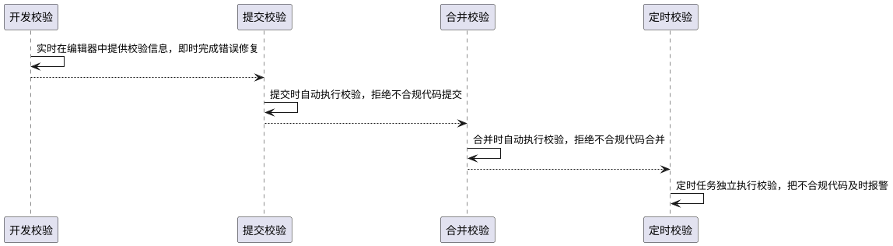

## 一、编程规范
软件的长期价值直接源于其编码质量。在软件的整个生命周期中，一个程序可能会被许多人阅读或修改。如果一个程序可以清晰的展现出它的结构和特征，那就能减少在以后对其进行修改时出错的可能性。

随着前端的成熟，有很多成熟的开源编码规范，比较通用的是[eslint-config-airbnb-base/eslint-config-airbnb](https://github.com/airbnb/javascript)、[eslint-config-standard](https://github.com/standard/eslint-config-standard)，eslint-config-airbnb-base严谨完备，完整的涵盖了编码、命名、排版、注释等方便的规范描述，选做编程规范的蓝本。详细规范细节请阅读[eslint-config-airbnb-base](https://github.com/airbnb/javascript)，本文不再阐述。

需要注意eslint-config-airbnb中含有React规则，在React项目中选择eslint-config-airbnb，在Vue和其他项目中选择eslint-config-airbnb-base。

### 1.1 规范概述

#### 1.1.1 TypeScript规范

现在的项目中，很多都使用的TypeScript。[@typescript-eslint/eslint-recommended](https://github.com/typescript-eslint/typescript-eslint/tree/master/packages/eslint-plugin/src/configs#recommended)中定义了TypeScript官网提到的最佳实践集合，可以在项目生产中直接使用。


#### 1.1.2 Vue编码规范
Vue 官方提供了详细的[风格指南 V3](https://vue3js.cn/docs/zh/style-guide/)和[风格指南 V2](https://cn.vuejs.org/v2/style-guide/)，和配套的[eslint-plugin-vue](https://eslint.vuejs.org)检查工具，用于代码质量的保证。

Vue 官方提供的规范分A-必要的、B-强烈推荐、C-推荐、D-谨慎使用4个级别，级别越高，代码的质量和规范性越强，作为专业的前端工程师产出的专业项目，启用ABCD四个级别的规范最大化收益。具体规则配置详见Vue3版本的项目模板[规则配置](https://git.100tal.com/jituan_middleplatform_talfer/startup-vue3-app/blob/master/generator/template/_eslintrc.js)。

#### 1.1.3 React编码规范
React 官方提供了[eslint-config-react-app](https://github.com/facebook/create-react-app/tree/master/packages/eslint-config-react-app)，同时包含了TypeScript规范，但并没有明确的编程文档规范说明。

规范的执行上，选择React默认的react规则集合，再加上eslint-config-airbnb，文档说明参考eslint-config-airbnb，执行中遇到细节，记录在本文档。


### 1.2 ECMAScript 6+规范

#### 1.2.1 解构赋值尽量使用一层结构
```javascript
// 不推荐
let [[a, b], c] = [[11, 22], 33];
```

```javascript
// 推荐
let [a, c] = [11, 22];
```

#### 1.2.2 数据拷贝推荐使用`...`实现，更加简洁高效
```javascript
// 推荐
const itemsCopy = [...items];
```

#### 1.2.3 数组简单循环遍历，优先使用`for...of`，非必须情况下不推荐使用`forEach`、`map`等
```javascript
// 不推荐
items.forEach(() => {});
```

```javascript
// 推荐
for (let item of items) {
}
```

#### 1.2.4 导出类名时，保持模块名和文件名相同

#### 1.2.5 导出单函数
```javascript
// 推荐
export function sum(value1, value2) {
  return value1 + value2;
}
```

#### 1.2.6 优先使用`async/await`

## 二、Linter工具
编码规范从语言正确性、语言特性和语言风格三方面定义了代码的规范性，借助Linter工具可以进一步保障规范的执行。

JavaScript代码（包含TypeScript代码，以及基于React.js和Vue.js框架的JS/TS代码）一般选择使用ESLint进行代码规则的校验。暂时不建议使用Prettier，主要原因是：
1. Prettier和Vue中的部分校验规则冲突；
2. Prettier在Lint层次是ESLint的子集，避免引入过多的工具导致项目的复杂性。

ESLint有很多可以自定义的[基础规则](https://cn.eslint.org/docs/rules/)，可以在rules中配置，选择合适的规则尽可能多的启用以全面保障代码质量，在开源编码规范[eslint-config-airbnb-base](https://www.npmjs.com/package/eslint-config-airbnb-base)的基础上扩展。

### 2.1 安装依赖
当使用TypeScript时，需要单独添加相关插件[@typescript-eslint/eslint-plugin](https://www.npmjs.com/package/@typescript-eslint/eslint-plugin)和[@typescript-eslint/parser](https://www.npmjs.com/package/@typescript-eslint/parser)。
当使用React/Vue时，需要单独添加相对应插件[eslint-plugin-react](https://www.npmjs.com/package/eslint-plugin-react)或[eslint-plugin-vue](https://www.npmjs.com/package/eslint-plugin-vue)。

按需安装，如果是Create-React-App创建的项目，下面大多数工具都已经存在，在package-lock.json中核实后再安装。

```shell
npm install eslint-plugin-import --save-dev
npm install eslint-import-resolver-alias --save-dev
npm install eslint-config-airbnb --save-dev
npm install eslint-config-airbnb-base --save-dev
npm install @typescript-eslint/parser --save-dev
npm install @typescript-eslint/eslint-plugin --save-dev
```


### 2.2 工具配置
eslint的配置文件是`.eslintrc.js`，可以根据需要进一步添加配置,详见Vue3版本的项目模板[规则配置](https://git.100tal.com/jituan_middleplatform_talfer/startup-vue3-app/blob/master/generator/template/_eslintrc.js)。

#### 2.2.1 React + TypeScript配置
```javascript
module.exports = {
  root: true,

  rules: {
    'no-console': process.env.NODE_ENV === 'production' ? 'warn' : 'off',
    'no-debugger': process.env.NODE_ENV === 'production' ? 'warn' : 'off',
    'class-methods-use-this': 0,
    indent: ['error', 2, { SwitchCase: 1 }],
    quotes: ['error', 'single'],
    semi: ['error', 'always'],
    'comma-dangle': ['error', 'always-multiline'],
    'max-len': [
      'error',
      {
        code: 120,
        tabWidth: 2,
        ignoreComments: true,
        ignoreTrailingComments: true,
        ignoreUrls: true,
        ignoreStrings: true,
        ignoreTemplateLiterals: true,
        ignoreRegExpLiterals: true,
      },
    ],
    '@typescript-eslint/no-unused-vars': 'error',
    'import/extensions': [
      'error',
      'always',
      {
        js: 'never',
        jsx: 'never',
        ts: 'never',
        tsx: 'never',
      },
    ],
    'react/jsx-filename-extension': [1, { extensions: ['.ts', '.tsx'] }],
  },

  settings: {
    'import/resolver': {
      node: {
        extensions: ['.js', '.json', '.ts', '.tsx'],
      },
    },
    'import/extensions': [
      '.js',
      '.jsx',
      '.ts',
      '.tsx',
    ],
  },

  extends: [
    'airbnb',
    'react-app',
    'react-app/jest',
  ],
};
```

#### 2.2.2. Vue + TypeScript配置
主要配置如下，具体配置详见[startup-vue3-app/generator/template/_stylelintrc.js](https://git.100tal.com/jituan_middleplatform_talfer/startup-vue3-app/blob/master/generator/template/_stylelintrc.js)。

```javascript
module.exports = {
  root: true,

  env: {
    node: true,
  },

  parserOptions: {
    ecmaVersion: 2020,
  },

  rules: {
    ...
  },

  settings: {
    'import/resolver': {
      alias: {
        map: [
          ['@', './src'],
        ],
        extensions: ['.ts', 'json', 'less', '.vue'],
      },
    },
  },

  overrides: [
    {
      files: [
        '**/__tests__/*.{j,t}s?(x)',
        '**/tests/unit/**/*.spec.{j,t}s?(x)',
      ],
      env: {
        jest: true,
      },
    },
  ],

  extends: [
    'eslint:recommended',
    'plugin:import/errors',
    'plugin:import/warnings',
    'plugin:import/typescript',
    'airbnb-base',
    'plugin:vue/recommended',
    '@vue/typescript/recommended',
    '@vue/prettier',
    '@vue/prettier/@typescript-eslint',
  ],
};
```


#### 2.2.3 关键配置项
1. ecmaVersion
用于指定ECMAScript版本，默认为5，可设置为6、7、8、9 或 10，也可设置为年份命名的版本号，比如2015（同 6），2016（同 7），或 2017（同 8）或 2018（同 9）或2019（同 10）或2020。

2. sourceType
sourceType有两个值script（默认）和module。当代码使用ES6及以上的模块语法时，需要设置为module。

3. ecmaFeatures
ecmaFeatures是一个对象，用于表示你想使用的额外的语言特性：
* globalReturn - 允许在全局作用域下使用 return 语句
* impliedStrict - 启用全局strict mode(如果 ecmaVersion 是 5 或更高)
* jsx - 启用 JSX
* experimentalObjectRestSpread - 启用实验性的 object rest/spread properties 支持

4. parser
解析器用于帮助ESLint确定什么是解析错误，默认为esprima。此外还有其它解析器：`babel-eslint` 用于解析babel代码，`@typescript-eslint/parser` 用于解析ts代码。

5. env
env用于设置当前项目运行的环境，ESLint能校验通过该环境对应的全局变量。
* browser：浏览器环境中的全局变量。
* node：Node.js 全局变量和 Node.js 作用域。
* commonjs：CommonJS 全局变量和 CommonJS 作用域 (用于 Browserify/WebPack 打包的只在浏览器中运行的代码)。
* shared-node-browser：Node.js 和 Browser 通用全局变量。
* es6：启用除了 modules 以外的所有 ECMAScript 6 特性（该选项会自动设置 ecmaVersion 解析器选项为 6）。
* worker：Web Workers 全局变量。
* amd： 将 require() 和 define() 定义为像 amd 一样的全局变量。

6. root
默认情况下，ESLint 会在所有父级目录里寻找配置文件，一直到根目录。为了将 ESLint 限制到一个特定的项目，在你项目根目录下的 package.json 文件或者 .eslintrc.* 文件里的 eslintConfig 字段下设置 "root": true。ESLint 一旦发现配置文件中有 "root": true，它就会停止在父级目录中寻找。

### 2.3 忽略设置
eslint自动忽略node_modules和bower_modules，在项目中，添加.eslintignore来设置校验规则忽略的文件。

### 2.4 自动修复
在命令行中添加`--fix`可以自动修复部分js/ts代码。需要注意的是：手工执行自动修复，以**确保变更是符合预期的**，切忌大范围的不能Review的自动修复。


## 三、再进一步

### 3.1 质量保障全生产链条覆盖

| 序号 | 环节     | 修复成本 | 说明 |
|:----:|:--------:|:--------:|------|
| 1    | 开发环节 | 低 | 代码编写时马上修改，第一次即生产高质量代码 |
| 2    | 提交环节 | 中 | 代码提交时尽早修改，不让低质量代码流出本机 |
| 3    | 合并环节 | 高 | 代码合并时关键修改，不让低质量代码流入仓库 |
| 4    | 定时环节 | 最高 | 代码合并后独立把关，代码质量报警和救赎 |

### 3.2 开发环节校验——eslint

安装eslint插件， 在VSCode中自动启动eslint的检查。


### 3.3 提交环节校验——husky & lint-staged
[husky](https://typicode.github.io/husky/#/)结合[lint-staged](https://github.com/okonet/lint-staged)可以在本地提交commit时进行相关校验。

> `pre-commit`钩子由`git commit`触发，在进行提交之前被调用，但可以使用`--no-verify`选项绕过。它不接受任何参数，脚本中退出非零状态会在创建提交之前中止`git commit`命令。 

#### 1. 安装husky和lint-staged

```shell
npm install husky --save-dev 
npm install lint-staged --save-dev
```

#### 2. 配置package.json
```json
{
  "husky": {
    "hooks": {
      "pre-commit": "lint-staged"
    }
  },
  "lint-staged": {
    "*.{ts,tsx,js,jsx}": [
      "npm run lint"
    ],
    "*.{css,scss,sass,less}": [
      "npm run lint:style"
    ]
  }
}
```
这里需要注意一点，`lint-staged`中会对匹配的文件都执行后面的命令，所以`key`值不能为`*`而是`*.{ts,tsx,js,jsx}`，不然当匹配到`a.json`时，会执行命令`npm run lint a.json`对json进行校验。当然，如果一点需要使用`*`，可以考虑在`.eslintignore`中进行设置。


#### 3. 结合Vue-Cli使用
[youkie](https://github.com/yyx990803/yorkie)fork自husky，做了一些定制化的改动 ,使得钩子能从package.json的 "gitHooks"属性中读取，本着减少工具的原则，如果直接用vue的脚手架就可以不用安装husky。具体使用方法如下，和husky基本一致。

##### 安装husky和lint-staged

```shell
npm install lint-staged --save-dev
```

##### 配置package.json
```json
{
  "gitHooks": {
    "pre-commit": "lint-staged"
  },
  "lint-staged": {
    "*.{ts,vue}": [
      "npm run lint"
    ],
    "*.{css,scss,sass,less,vue}": [
      "npm run lint:style"
    ]
  }
}
```


### 3.4 合并环节校验——CI校验

`pre-commit`钩子可以通过`--no-verify`绕过，所以我们在gitlab中还需要添加pipelines用于自动校验，并将校验结果及时反馈。

Todo: 待整合到template中。


### 3.5 定时环节校验——[Echo](http://echo.100tal.com)/[Sonar](https://www.sonarqube.org)校验

Todo: 细化Echo/Sonar校验细化规则规则。


## 四、参考
1. [@typescript-eslint/eslint-recommended](https://github.com/typescript-eslint/typescript-eslint/tree/master/packages/eslint-plugin/src/configs#recommended)
