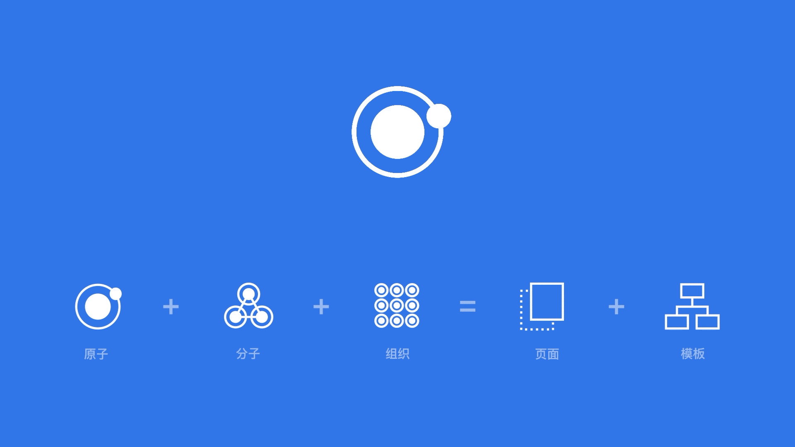
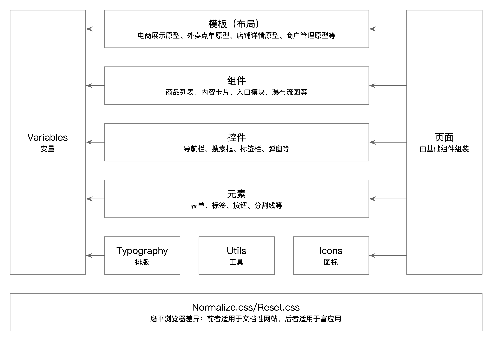
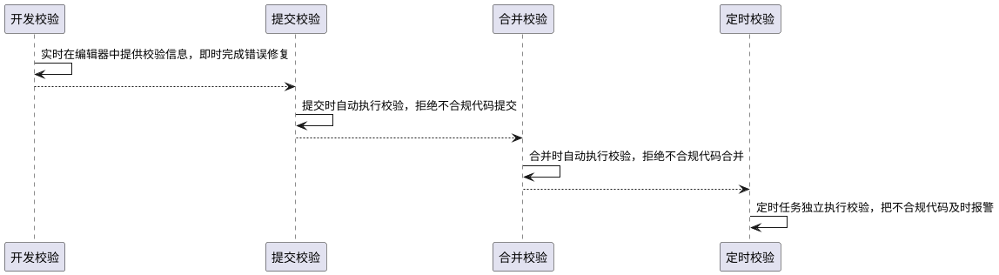

网站的整体外观和风格由视觉设计师决定，前端工程师掌控对应的开发方法和系统设计哲学。


## 一、设计系统

视觉设计师通过视觉语言描述网站（包括桌面软件、手机软件等其他产品）如何通过视觉与用户沟通。

前端工程师的工作目标不是单纯的实现某个页面，而是设计整个可扩展且可持续的设计系统——把视觉语言拆解成可组合的最小单元，并实现为具有可扩展性和可维护性的代码，创建规则将这些最小单元重组为整个网站，以便如实地重现视觉语言能表达的任何东西。

设计系统是网站视觉语言的程序化呈现，集合了颜色、字体、按钮、图片样式、排版布局和界面版式，用来传达情绪、意义和目的。

### 1.1 原子设计

设计系统是一组相互关联的设计模式与共同实践的结合，以连贯组织来达成数字产品的目的。模式是重复组合以创建界面的元素，如用户流、交互、按钮、文本、图标、颜色、排版、微观等。实践则是选择、创建、捕获、共享和使用这些模式的方法，特别是在团队中工作时。构建设计系统时，需要模块化的分层方法，并且需要能与模式库相结合。

Brad Frost的原子设计原则是一种构建网站设计系统，通过可分解的模块来组合成网站的设计方法论。首先把网页常用元素分解成各个尺寸的模式，然后再描述把这些模式组合成一个完整网页的方式。与设计师的设计系统概念相吻合、又能满足模式库的原则。

[](http://meux.baidu.com/articles/6)

原子设计由五种不同粒度的模块组合而成，它们协同工作，以创建一个有层次、有计划的界面系统：
1. 原子（元素），即事物的基本组成部分。它是最小的单元，不能再往下细分，也就是基本的HTML标签，比如表单、标签、按钮、分割线等。
2. 分子（控件），即由原子聚合而成的粒子。在UI设计中，分子是由几个基本的HTML标签组成的简单组织，比如导航栏、标签栏、搜索框、弹窗等。
3. 有机体（组件），即由分子、原子或其他有机体组成的相对复杂的UI组件，承载独立、可复用的内容，比如头部、尾部、商品列表、内容卡片、入口模块、瀑布流图等。
4. 模板（布局），即整合前面的元素，构建整体的布局，将组件在这个布局的上下文中结合到一起。比如博客包含头部、尾部及博客内容，三者可以构建一个基本的外观，又比如电商展示原型、外卖点单原型、店铺详情原型、商户管理原型等。
5. 页面，即用真实的内容（数据）展示出来的最终产品，比如商品列表页、外卖点单页、教育课程页、资讯管理页等。如果设计系统的弹性不足，会限制页面的实现。


### 1.2 实现规则
1. 尽可能复用小的模块，而不是弄出几十个、甚至上百个不同的内容块。将内容块拆分为最小的独立可重用模块，并根据需求决定是否增加新的布局或组件。
2. 永远不要给布局的子内容强加内边距和元素样式。布局只关注垂直对齐、水平对齐和文字间距。
3. 主题和数据属性值永远不要强制改变外观，必须保持布局、组件和元素可以在其上应用。
4. 组件总是贴着他它父容器的四个边，元素都没有上外边距和左外边距，所有的最后节点（最右边和最下边的节点）的外边距都会被清除。
5. 组件本身永远不要添加背景、宽度、浮动、内边距和外边距的样式，组件样式是组件内元素的样式。
6. 每个元素都有且只有一个唯一的且作用域只在组件内的CSS类名。所有的样式都是直接应用到这个选择器上，并且只有上下文和主题能修改元素的样式（给每一个标签元素创造单一的、唯一的、扁平的CSS类选择器）。
7. 永远不要在元素上使用上外边距，第一个元素总是贴着它所在组件的顶部。
8. JavaScript永远不要绑定任何元素的CSS类名，选中元素通过数据属性实现。


### 1.3 总体框架




## 二、模块化
模块化用来解决CSS层叠样式表所带来的选择器优先级、颜色重置、位置依赖、多重继承、深层嵌套等问题。模块在大多数语境中等同于Vue/React/Angular等框架中的组件，上述有机体（组件）中的组件所指一种较大完整功能模块的含义，注意“组件”这个词汇在上下文语境中的区分。

### 2.1 模块化原则
1. [HTML标记规范化](./spec-template.md)；
2. 分离结构和外观；
3. 分离容器和内容；
4. 区分布局和组件的角色和职责；
5. 在标记上使用单一、扁平的选择器；
6. 单一职责原则：创建的所有选择器都必须有单一的、高度聚焦的责任，为了单一目的而创建，并且能够很好地实现这个目标；创建的每一个CSS类都用于单一的目的和单一的位置，在某些具体场景下，可以用一个CSS类来设置元素的盒模型的属性，另一个设置排版，还有一个设置颜色和背景；
7. 单一样式来源：单一职责原则的深层次使用，不仅每个CSS类名被创建为单一用途，而且每个标签的样式也只有单一的来源。在一个模块化设计中，任何组件的样式必须由组件本身决定，而不应该被其他类所限制，即不依赖其他块或元素。将上下文相关的样式统一放置在组件模块代码中，修饰与上下文对标签样式的任何改变都会和标签的原始样式定义在同一个文件，不要分散在不同的文件；
8. 内容修饰符：虽然单一样式来源的方法确实可以让代码变得更清晰，但是如果要跟踪多个不同的上下文还是很困难。组件修饰符又称皮肤或者子组件，能够定义一个组件在多个不同情况下的多种变化。所有组件的变动都在一个文件里，而且能用到任何需要的地方，而不依赖于不确定的父节点CSS类名。


### 2.2 模块化方案——OOCSS
[OOCSS](http://oocss.org)（Object-Oriented CSS），面向对象的CSS，典型案例是[Bootstrap](https://getbootstrap.com)，常见的toggle组件示例如下：

```html
<div class="toggle simple">
	<div class="toggle-control open">
		<h1 class="toggle-title">Title 1</h1>
	</div>
	<div class="toggle-details open">...</div>
	...
</div>
```

主要原则有以下两个：
1. 分离结构和外观：意味着将视觉特性定义为可复用的单元，如上例中`toggle`、`toggle-control`、`toggle-title`和`toggle-detail`4个类是结构类，`simple`是外观类。
2. 分离容器和内容：指的是不再将元素位置作为样式的限定词，如上例中`toggle`、`toggle-control`、`toggle-title`和`toggle-detail`4个类只是容器。


### 2.3 模块化方案——SMACSS
[SMACSS](http://smacss.com)（Scalable and Modular Architecture for CSS），模块化可扩展的CSS，常见的toggle组件的示例如下：

```html
<div class="toggle toggle-simple">
	<div class="toggle-control is-active">
		<h1 class="toggle-title">Title 1</h1>
	</div>
	<div class="toggle-details is-active">...</div>
	...
</div>
```

把样式系统划分为5个类别：
1. 基础：整个页面纯标记（所有标签都不添加CSS）显示的基本外观样式。
2. 布局：把页面分成不同区域。
3. 模块：设计中的模块化、可复用的单元。
4. 状态：描述在特定的状态或情况下，模块或布局的显示方式。
5. 主题：一个可选的视觉外观层，可以为页面更换不同主题。

对于如何创建功能的小模块，SMACSS和OOCSS有许多相似之处。都是把样式作用域限定到根节点的CSS类名上，然后通过皮肤（OOCSS，simple是皮肤）或子模块（SMACSS，toggle-simple是toggle组件的一个子模块）进行修改。


### 2.4 模块化方案——BEM
[BEM](http://getbem.com)（Block Element Modifier），块-元素-修饰符，在SMACSS的基础上修改toggle组件的示例如下：

```html
<div class="toggle toggle—simple">
	<div class="toggle__control toggle__control--active">
		<h1 class="toggle__title">Title 1</h1>
	</div>
	<div class="toggle__details toggle__details--active">…</div>
	...
</div>
```
BEM只是一个CSS类名命名规则，让每一个CSS类名具备详细的自描述性，不涉及如何书写CSS结构，只是建议每个元素都添加带有如下内容的CSS类名：
1. 块名：所属组件的名称。
2. 元素：元素在块里面的名称。
3. 修饰符：任何与块或元素相关联的修饰符。

元素名加在双下划线之后（例如`toggle__details`），修饰符加在双横杠之后（如`toggle__details--active`）。


### 2.5 模块化方案实践
综上，OOCSS和SMACSS两种方案的思路基本一致，模块化方案实践综合上述3者，命名规范采用直白清晰的BEM格式约束，即参考上述BEM的toggle组件示例。


## 三、编码规范
CSS，包括Less和Sass等预处理语言，是前端代码中的3大组成部分之一，其书写简便，语法宽松，但也常常伴随着一些错误，对其规范的价值和重要性不言而喻。另外只要代码质量是可以被维护的，就能很好的被工具混淆、压缩和合并。

定义适用于CSS/Less/Sass文件的编写格式和风格规则，目的是提高合作和代码质量，并使其支持基础架构。并进一步使用[stylelint](https://stylelint.io/)来保障规范的执行（和eslint校验类似，stylelint也有一个配置文件`.stylelintrc.js`）。


### 3.1 编码
1. 用不带BOM头的UTF-8编码。
2. 换行符统一使用`LF`。
3. 使用有效的CSS代码，避免使用CSS “hacks”。使用有效的CSS是重要的质量衡量标准，如果发现有的CSS代码没有任何效果的可以删除，确保CSS用法适当。


### 3.2 命名
优先使用简短、功能性或通用的名字，方便理解，会减少不必要的文档或模板修改。具体规则如下：
1. 格式严格遵循[bem](http://getbem.com/naming/)命名规范，元素名加在双下划线之后（例如`toggle__details`），修饰符加在双横杠之后（如`toggle__details--active`），多个单词组成的块名、元素、修饰符中间用中横杠连接；
2. 仅使用小写字母，包括选择器、属性、属性值（`content`属性的字符串属性值例外）；
3. 仅使用类名选择器，并且取功能性/通用且有意义的名字（CSS类名取决于适用在哪些地方，而不是这些样式本身），禁止标签名和ID选择器（在Vue中建议使用[CSS Modules](https://vue-loader.vuejs.org/zh/guide/css-modules.html)，不建议使用[Scoped CSS](https://vue-loader.vuejs.org/zh/guide/scoped-css.html)）；


### 3.3 排版

#### 3.3.1 缩进
缩进所有代码块（“{}”之间）内容，每次缩进2个空格，不要用TAB键或多个空格来进行缩进，提高代码层次结构的清晰度。
```css
/* 不推荐 */
.example {
color: blue;
}

@media screen, projection {
  html {
      background: #ffffff;
      color: #ffffff;
  }
}
```
```css
/* 推荐 */
.example {
  color: blue;
}

@media screen, projection {
  html {
    background: #ffffff;
    color: #444444;
  }
}
```

#### 3.3.2 声明完结
所有声明都要用“;”结尾。考虑到一致性和拓展性，请在每个声明尾部都加上分号。

```css
/* 不推荐 */
.test {
  display: block;
  height: 100px
}
```

```css
/* 推荐 */
.test {
  display: block;
  height: 100px;
}
```


#### 3.3.3 属性名完结
在属性名冒号结束后加一个空字符。出于一致性的原因，在属性名和值之间加一个空格。

```css
/* 不推荐 */
h3 {
  font-weight:bold;
}
```
```css
/* 推荐 */
h3 {
  font-weight: bold;
}
```

#### 3.3.4 选择器和声明分行

将选择器和声明隔行。每个选择器和声明都要独立新行。

```css
/* 不推荐 */
a:focus, a:active {
  position: relative; top: 1px;
}
```

```css
/* 推荐 */
h1,
h2,
h3 {
  font-weight: normal;
  line-height: 1.2;
}
```

#### 3.3.5 规则分行
每个规则独立一行。两个规则之间隔行。

```css
html {
  background: #fff;
}

body {
  margin: auto;
  width: 50%;
}
```


#### 3.3.6 删除行尾白空格
删除行尾白空格。行尾空格没必要存在。


### 3.4 属性/属性值

#### 3.4.1 尽量使用缩写

写属性和属性值的时候尽量使用缩写，甚至只设置一个值。很多CSS属性都支持缩写[shorthand](http://www.w3.org/TR/CSS21/about.html#shorthand)，例如`font`。使用缩写可以提高代码的效率，方便理解。

```css
/* 不推荐 */
padding-top: 0;
padding-bottom: 2em;
padding-left: 1em;
padding-right: 1em;
font-family: palatino, georgia, serif;
font-size: 100%;
line-height: 1.6;
border-top-style: none;
```

```css
/* 推荐 */
border-top: 0;
font: 100%/1.6 palatino, georgia, serif;
padding: 0 1em 2em;
```


#### 3.4.2 省略0后面的单位
省略0后面的单位。非必要的情况下`0`后面不用加单位。

```css
/* 不推荐 */
margin: 0px;
padding: 0px;
```

```css
/* 推荐 */
margin: 0;
padding: 0;
```


#### 3.4.3 不要省略小数点前面的0
不要0开头小数点前面的0。保持代码的可读性，压缩的工作交给工具。

```css
/* 不推荐 */
font-size: .8em;
```
```css
/* 推荐 */
font-size: 0.8em;
```


#### 3.4.4 省略URI外的引号
省略URI外的引号。不要在`url()`里用 (`""`,`''`) 。

```css
/* 不推荐 */
@import url("//www.google.com/css/go.css");
```

```css
/* 推荐 */
@import url(//www.google.com/css/go.css);
```


#### 3.4.5 十六进制使用6个字符
颜色值中的十六进制使用6个字符。保持代码的可读性，压缩的工作交给工具。

```css
/* 不推荐 */
color: #ebc;
```
```css
/* 推荐 */
color: #eebbcc;
```

#### 3.4.6 省略厂商前缀

省略厂商前缀，保持代码的可读性，通过PostCSS之类工具的自动补全完成。

#### 3.4.7 固定代码顺序
1. dollar-variables/at-variables，Sass/Less变量声明
2. [Custom Properties](https://developer.mozilla.org/en-US/docs/Web/CSS/--*)
3. at-rules
4. declarations
5. supports at-rule
6. media at-rule
7. rules

#### 3.4.8 固定声明顺序
CSS不同类型属性的数据如下，具体属性顺序参看下面配置。
1. Content
2. Positioning
3. Display & Flex/Grid
4. Box Model
5. Border
6. Background
7. Font & Text
8. Transition & Transform & Animation
9. Other


### 3.5 注释
1. 适当合理用注释来解释代码：它包括是什么，它的目的是什么，它能做什么，为什么使用这个解决方案？
2. 按组写注释，按照功能的类别来对一组样式表写统一注释。独立成行。
3. 只用`TODO`来强调代办事项，不要用其他的常见格式，例如`@@`。
    1. 可在括号里面附加联系人（用户名或电子邮件列表），例如`TODO(contact)`。
    2. 可在冒号之后附加活动条目说明等，例如`TODO: 活动条目说明`。

```css
/* Header */
.adw-header {
}

/* Footer */
.adw-footer {
}

/* Gallery */
.adw-gallery {
}

/* TODO(cha.jn): 重新置中 */
.example {
}

/* TODO: 删除可选元素 */
.example {
}
```

### 3.6 其他

#### 3.6.1 协议
省略嵌入式资源协议声明，即省略图像、媒体文件、样式表和脚本等URL协议头部声明`http:`和`https:`，如果不是这两个声明的URL则不省略。

省略协议声明，使URL成相对地址，防止内容混用问题（[Mixed Content](https://developer.mozilla.org/en-US/docs/Web/Security/Mixed_content)），避免小文件重复下载。

```css
/* 不推荐 */
.example {
  background: url(http://www.google.com/images/example);
}
```
```css
/* 推荐 */
.example {
  background: url(//www.google.com/images/example);
}
```


## 四、Linter工具

编码规范从语言正确性、语言特性和语言风格三方面定义了代码的规范性，借助Linter工具可以进一步保障规范的执行，自动识别非法颜色值、Calc错误参数、单位错误、属性拼写错误等。在StyleLint中，有170+条相关[内置规则](https://stylelint.io/user-guide/rules/list)可以在rules中进行配置，完整覆盖上面的规范。


在实际项目中，可以在官方预定义的规则集[stylelint-config-standard](https://www.npmjs.com/package/stylelint-config-standard)（已经覆盖了Idiomatic CSS Principles，Google's CSS Style Guide，Airbnb's Styleguide 和 @mdo 的 Code Guide 4份规范的最佳实践）基础上进行扩展。默认`severity`为`error`。


### 4.1. 安装依赖
```shell
npm install stylelint --save-dev
npm install stylelint-config-standard --save-dev
npm install stylelint-scss --save-dev
npm install stylelint-selector-bem-pattern --save-dev
npm install stylelint-order --save-dev
```


### 4.2 工具配置
stylelint的配置文件是`.stylelintrc.js`，可以根据需要进一步添加[建议配置](https://github.com/stylelint/stylelint-config-standard#suggested-additions)，配置详见[startup-vue3-app/generator/template/_stylelintrc.js](https://git.100tal.com/jituan_middleplatform_talfer/startup-vue3-app/blob/master/generator/template/_stylelintrc.js)。

```javascript
module.exports = {
  extends: 'stylelint-config-standard',
  plugins: [
    'stylelint-scss',
    'stylelint-selector-bem-pattern',
    'stylelint-order',
  ],
  rules: {
    'plugin/selector-bem-pattern': {
      // 指定Preset Patterns，支持suit和bem两种（无默认值）
      preset: 'bem',
      componentSelectors: {
        initial: '^\\.{componentName}(?:__[-a-z]+)?(?:--[a-z]+)?$',
        combined: '^\\.{componentName}(?:__[-a-z]+)(?:--[a-z]+)?$',
      },
      utilitySelectors: '^\\.util-[a-z]+$',
      ignoreSelectors: ['^\\.icon-'],
      ignoreCustomProperties: [],
      implicitComponents: true
    },
    'order/order': [
      [
        'dollar-variables',
        'at-variables',
        'custom-properties',
        'at-rules',
        'declarations',
        {
          type: 'at-rule',
          name: 'supports',
        },
        {
          type: 'at-rule',
          name: 'media',
        },
        'rules',
      ],
      {
        severity: 'warning',
				disableFix: true,
      },
    ],
    'order/properties-order': [
      [
        // 详见startup-vue3-app/generator/template/_stylelintrc.js
        // Content
        ...
        // Positioning
        ...
        // Display & Flex/Grid
        ...
        // Box Model
        ...
        // Border
        ...
        // Background
        ...
        // Font & Text
        ...
        // Transition & Transform & Animation
        ...
        // Other
        ...
      ],
      {
        unspecified: 'bottom',
        severity: 'warning',
      },
    ],
  },
};
```


### 4.3 忽略配置
stylelint自动忽略node_modules和bower_modules，在项目中，添加.stylelintignore来设置校验规则忽略的文件。

```plain
*.js
*.png
*.eot
*.ttf
*.woff
```
### 4.4 命令配置
在package.json中，集成scripts命令的脚本如下

```shell
"scripts": {
  "lint:style": "stylelint src/**/*.{css,scss,sass,less,vue}"
}
```

### 4.5 自动修复

在命令行中添加`--fix`，在可能的情况下（有些情况下无法进行修复），则可以自动修复不满足规则的css代码。需要注意的是：手工执行自动修复，以**确保变更是符合预期的**，切忌大范围的不能Review的自动修复。

> 对于具有标准语法的CSS，stylelint使用postcss-safe-parser修复语法错误。 

```shell
"scripts": {
  "lint:style": "stylelint src/**/*.{css,scss,sass,less,vue} --fix"
}
```

### 4.6 Vue-Cli集成
详细参考[Vue Loader 中 StyleLint](https://vue-loader.vuejs.org/zh/guide/linting.html#stylelint)的介绍，配置参考[Vue Cli webpack 相关](https://cli.vuejs.org/zh/guide/webpack.html)，主要配置如下。

#### 1. 安装依赖
```shell
npm install -D stylelint-webpack-plugin
```

#### 2. 添加配置
```javascript
const StyleLintPlugin = require('stylelint-webpack-plugin');

module.exports = {

  configureWebpack: {
    plugins: [
      new StyleLintPlugin({
        files: ['src/**/*.{vue,htm,html,css,sss,less,scss,sass}'],
      }),
    ],
  },

};
```


## 五、再进一步

### 5.1 质量保障全生产链条覆盖

| 序号 | 环节     | 修复成本 | 说明 |
|:----:|:--------:|:--------:|------|
| 1    | 开发环节 | 低 | 代码编写时马上修改，第一次即生产高质量代码 |
| 2    | 提交环节 | 中 | 代码提交时尽早修改，不让低质量代码流出本机 |
| 3    | 合并环节 | 高 | 代码合并时关键修改，不让低质量代码流入仓库 |
| 4    | 定时环节 | 最高 | 代码合并后独立把关，代码质量报警和救赎 |

### 5.2 开发环节校验——vscode-stylelint

[vscode-stylelint](https://github.com/stylelint/vscode-stylelint)是VS Code的stylelint插件，可以提供编码时的实时校验和自动修复能力。

在`.vscode/settings.json`或者设置选项中添加以下信息，会启动stylelint插件的自动修复功能，在保存当前文件时，会由stylelint自动修复代码。但千万注意**确保变更是符合预期的**，切忌大范围的不能Review的自动修复。

```plain
{
  "editor.codeActionsOnSave": {
    "source.fixAll.stylelint": true
  }
}
```


### 5.3 提交环节校验——husky & lint-staged
[husky](https://typicode.github.io/husky/#/)结合[lint-staged](https://github.com/okonet/lint-staged)可以在本地提交commit时进行相关校验。

> `pre-commit`钩子由`git commit`触发，在进行提交之前被调用，但可以使用`--no-verify`选项绕过。它不接受任何参数，脚本中退出非零状态会在创建提交之前中止`git commit`命令。 

#### 1. 安装husky和lint-staged

```shell
npm install husky --save-dev 
npm install lint-staged --save-dev
```

#### 2. 配置package.json
```json
{
  "husky": {
    "hooks": {
      "pre-commit": "lint-staged"
    }
  },
  "lint-staged": {
    "*.{ts,tsx,js,jsx}": [
      "npm run lint"
    ],
    "*.{css,scss,sass,less}": [
      "npm run lint:style"
    ]
  }
}
```
这里需要注意一点，`lint-staged`中会对匹配的文件都执行后面的命令，所以`key`值不能为`*`而是`*.{css,scss,sass,less}`，不然当匹配到`a.json`时，会执行命令`npm run lint:style a.json`对json进行校验。当然，如果一点需要使用`*`，可以考虑在`.stylelintignore`中进行设置。


#### 3. 结合Vue-Cli使用
[youkie](https://github.com/yyx990803/yorkie)fork自husky，做了一些定制化的改动 ,使得钩子能从package.json的 "gitHooks"属性中读取，本着减少工具的原则，如果直接用vue的脚手架就可以不用安装husky。具体使用方法如下，和husky基本一致。

##### 安装husky和lint-staged

```shell
npm install lint-staged --save-dev
```

##### 配置package.json
```json
{
  "gitHooks": {
    "pre-commit": "lint-staged"
  },
  "lint-staged": {
    "*.{ts,vue}": [
      "npm run lint"
    ],
    "*.{css,scss,sass,less,vue}": [
      "npm run lint:style"
    ]
  }
}
```


### 5.4 合并环节校验——CI校验

`pre-commit`钩子可以通过`--no-verify`绕过，所以我们在gitlab中还需要添加pipelines用于自动校验，并将校验结果及时反馈。

Todo: 待整合到template中。


### 5.5 定时环节校验——[Echo](http://echo.100tal.com)/[Sonar](https://www.sonarqube.org)校验

Todo: 细化Echo/Sonar校验细化规则规则。


## 六、常见问题
1. css中存在`/*# sourceMappingURL=defaultTheme.css.map */`，且该文件中存在css校验不通过的内容，那么在调用`stylelint --fix`时，会把`/*# sourceMappingURL=defaultTheme.css.map */`给删除。


## 七、Todo
1. 样式的可测试性——可视化回归测试、单元测试、性能测试；
2. 待合并环节校验整合到template中；
3. 待定时环节校验——Echo/Sonar校验细化规则。


## 八、参考
1. [原子设计快速构建产品原型](http://maidianlabs.com/a/rizi/2018/0921/57.html)
2. [使用 stylelint检查CSS](https://www.w3cplus.com/css/stylelint.html)（[https://www.w3cplus.com/css/stylelint.html](https://www.w3cplus.com/css/stylelint.html)）
3. [详解前端规范工具链落地实战【别让你定的规范只停在口头上】](https://juejin.im/post/6862341107859062791)（[https://juejin.im/post/6862341107859062791](https://juejin.im/post/6862341107859062791)）
4. [Google HTML/CSS Style Guide](https://google.github.io/styleguide/htmlcssguide.html)
5. [Handling character encodings in HTML and CSS](http://www.w3.org/International/tutorials/tutorial-char-enc/)
6. [order.js](https://github.com/hudochenkov/stylelint-config-hudochenkov/blob/master/order.js)
