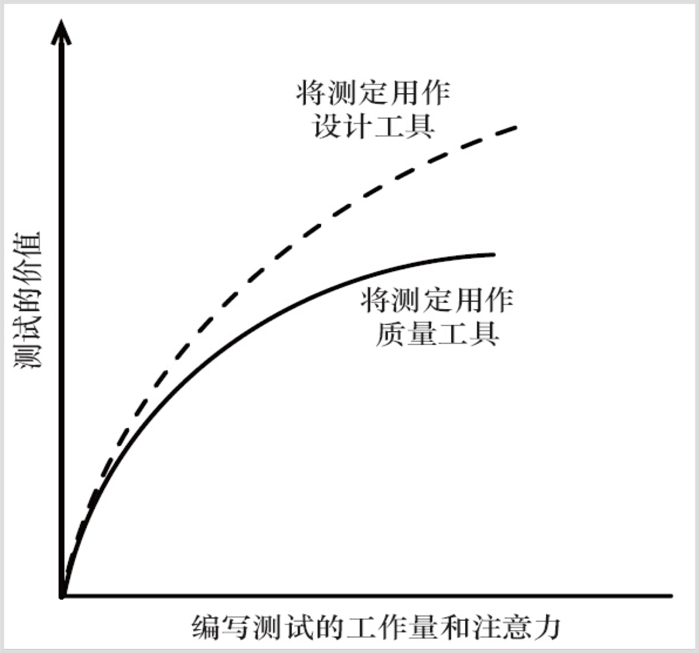

## 一、测试本质
> 人的思维不是完美的，而软件测试的最终目的就是发现对改善软件产品和软件开发过程有益的信息，故软件测试是一个信息获取的过程
> 
> —–《颠覆完美软件》，杰拉尔德·温伯格，计算机名人堂


本质上，函数的相互调用、全局变量的设置之间是相互的契约——这也是不可变原则的底层原因。软件测试是对契约的约束，常见形式有：契约测试、单元测试、集成测试、E2E测试、UI测试等自动化测试。为什么一定要是自动化的呢？

在软件迭代过程中，熵（无序度）不断增加——对抗熵增的过程需要能量的持续输入来获取信息以保持有序——架构的简洁和实现的规范，机器电能的输入比人力生物能的输入性价比更高——最大化延长软件的生命。

> 人活着就是在对抗熵增定律，生命以负熵为生。
> 
> ——《生命是什么》，薛定谔


### 1.1 单元测试定义
单元测试（Unit Testing），又称为模块测试，是针对程序模块来进行正确性检验的测试工作。
程序模块是软件设计的最小单位，程序单元是应用的最小可测试部件——简单说就是测试模块中公开的函数。
1. 在面向过程编程中，一个单元就是单个程序、函数、过程等；
2. 在面向对象编程中，最小单元就是方法，包括基类（超类）、抽象类、或者派生类（子类）中的方法。


### 1.2 单元测试局限
按定义，单元测试只测试程序单元自身的功能。因此，它不能发现集成错误、性能问题、或者其他系统级别的问题。单元测试结合其他软件测试活动更为有效。与其它形式的软件测试类似，单元测试只能表明测到的问题，不能表明不存在未测试到的错误。


软件的质量不是测试出来的，而是设计和维护出来的。就像工匠们在一点一点地雕琢他们的作品一样。


### 1.3 功能测试定义
功能测试，也称为e2e测试，即站在用户角度的一种黑盒测试，通过编写测试用例，自动化模拟用户操作，确保组件间通信正常，程序流数据传递如预期。

关注的是一个完整的操作链是否能够完成。对于Web前端来说，还关注 界面布局、内容信息是否符合预期。


### 1.4 功能测试局限
功能测试相对比较重。


### 1.5 测试驱动开发
测试驱动开发是一个简单有效的高质量代码开发方式，仅包含3个步骤：
1. 红色指示条——编写一个无法工作的简单测试，当然，这个测试起初甚至都无法通过编译
2. 绿色指示条——迅速使测试工作起来，这个过程可谓想方设法，甚至不择手段
3. 重构——去掉单纯由于使测试工作起来而产生的重复部分


运行和简洁在TDD中作为两个独立目标分而治之，运行是第一步，简洁是第二步，两步完成才是结束。TDD有助于异常常态化的处理——先异常再处理。测试驱动是一个设计的完善过程和优化过程，其要点不在于采取了哪些措施，而在于能够取得这些微小进步本身。

TDD无法保证让你在需要的时候灵光乍现，给人以信心的测试和精心重构过的代码给你产生灵感做准备，当灵感来临时，可以直接动手将一种认识/知（比如对副作用/坏味道的厌恶），转换为对应的一个/组测试用例和简洁、重构优化过的方法。需要注意的是：单元测试的代码也需要重构

> 对于软件工程师来说，重构，并不是额外的工作，它就是编码本身
> 
> ——乔梁

驱动测试开发的本质是：实现之前先验证设计。在编写代码之前就指出代码的期望行为，从而在验证实现之前先验证设计。从调用者的角度来审视代码的设计和行为——TDD是一种优化设计的方法，将设计优化不断进行，以实现可运行的简洁代码。

两个暂时没有结论的观点对比：
1. “编码是为了今天，设计是为了明天”；
2. “编码是为了明天，设计是为了今天”。

提前充分的设计依然是必要的，架构设计是需求理解的过程，测试驱动是小步骤不断优化的。TDD不是从0开始，可以基于自己过去的经验开始。
不是从0到100，而是从60到100。


### 1.6 双稳态定律


单元测试的完整价值——双稳态定律（Law of the Two Plateaus）：
1. 质量工具：提高程序员的生产力，保证开发速度
2. 设计工具：持续优化设计，保持“简单设计的4条规则”如下：
    1. 运行所有测试
    2. 不可重复
    3. 表达力
    4. 尽可能减少类和方法的数量

双稳态定律的核心是编写测试的最大价值不在于结果，而在于编写过程中的学习。价值来自于创新及设计导向，而非防止回归缺陷的保护及验证导向。为了能同时达到两个稳态，从而完全发挥测试的潜力，需要：
1. 像生产代码一样对待你的测试代码——大胆地重构、创建和维护高质量测试，自己要对它们有信心。
2. 开始将测试作为一种设计工具，指导代码针对实际用途进行设计。


## 二、测试用例设计

### 2.1 等价类划分
等价类划分，将所有可能的输入数据划分成若干个子集，在每个子集中，如果任意一个输入数据对于揭露程序中潜在错误都具有同等效果，那么这样的子集就构成了一个等价类，简单说就是分门别类。后续只要从每个等价类中任意选取一个值进行测试，就可以用少量具有代表性的测试输入取得较好的测试覆盖结果。


#### 等价类划分指南：
1. 如果输入条件规定了输入值范围，可以确定出一个有效等价类和两个无效等价类；
2. 如果输入条件规定了输入值个数，可以确定出一个有效等价类和两个无效等价类；
3. 如果输入条件规定了输入值集合，而且有理由认为程序会对每个输入值进行不同处理，就应为每个输入值确定一个有效等价类和一个无效等价类；
4. 如果输入条件规定了“必须是”情况，可以确定一个有效等价类和一个无效等价类；
5. 如果有任何理由可以认为程序并未等同地处理等价类中的元素，那么应该将这个等价类再划分为小一些的等价类。


### 2.2 边界值分析
边界值分析，选取输入、输出的边界值进行测试。通常大量的软件错误是发生在输入或输出范围的边界上，需要进行重点测试，通常选取正好等于（上点）、刚刚大于（离点）或刚刚小于（内点或离点）边界的值作为测试数据。


#### 边界值分析指南：
1. 如果输入条件规定了输入值范围，应根据上下边界设计重合以及刚刚越界的无效输入测试用例；
2. 如果输入条件规定了输入值数量，应针对最小数量输入值、最大数量输入值，以及比最小数量少一个、比最大数量多一个的情况设计测试用例；
3. 对每一个输入条件应用指南1；
4. 对每一个输出条件应用指南2；
5. 如果程序的输入或输出是一个有序序列（顺序文件、线性列表或表格），应特别注意该序列的第一个和最后一个元素；
6. 发挥聪明才智找出其他的边界条件。


### 2.3 仅关心输入/输出
撰写组件公共接口的测试，并在一个黑盒内部处理。一个简单的测试用例将会断言一些输入 (用户的交互或 prop 的改变) 提供给某组件之后是否导致预期结果 (渲染结果或触发自定义事件)。
好处是即便该组件的内部实现已经随时间发生了改变，只要你的组件的公共接口始终保持一致，测试就可以通过。

比如，对于每次点击按钮都会将计数加一的 Counter 组件来说，其测试用例将会模拟点击并断言渲染结果会加 1。该测试并没有关注 Counter 如何递增数值，而只关注其输入和输出。


### 2.4 明确测试目标

在一个测试用例中，专注在一个孤立的单元中测试组件，避免对其子组件的行为进行间接的断言，比如在Vue中可以使用Vue Test Utils的`shallowMount`方法。对于包含许多子组件的组件来说，整个渲染树可能会非常大，重复渲染所有的子组件会让测试变慢。


## 三、单元测试编写

### 3.1 原则
单元测试FIRST规则：
1. 快速（Fast），测试应该能快速运行；
2. 独立（Independent），测试应该相互独立，可以单独运行每个测试，及以任何顺序运行测试，某个测试不应为下一个测试设定条件。
3. 可重复（Repeatable），测试应当可以在任何环境中重复通过（生产环境、质检环境、笔记本、台式机）。
4. 自验证（Self-Validating），测试应该有布尔值输出。
5. 及时（Timely），测试应该及时编写，生产代码难以测试。


### 3.2 目标
三个目标：可读、可达、可理解，其中最重要的要素是：*可读性*，**可读性**和***可读性***。


### 3.3 方法
单元测试的方法，基本上是三步走，有两种常见的实践：
1. 准备-执行-断言（Arrange - Act - Assert）实践：
    1. 先准备用于测试的对象；
    2. 然后触发执行；
    3. 最后对输出进行断言。
2. 给定-当-那么（Given，When，Then）实践：
    1. 给定（某个上下文）；
    2. 当（发生某些事情）；
    3. 那么（期望某些结果）。


### 3.4 注意

糟糕测试的坏味道：
1. 冗长的设置代码；
2. 重复的设置代码；
3. 过长的运行时间；
4. 脆弱的测试。


### 3.5 组织
单元测试文件后缀统一使用`.spec.js`，文件名和要测试的文件保持一致，放在同一级目录，方便组件的整体迁移和相对路径引用，比如`App.ts`和`App.spec.ts`。


### 3.6 工具——Jest
Jest是当下最流行的JavaScript测试框架，基于[jsdom](https://github.com/jsdom/jsdom)实现，旨在确保任意JavaScript代码的正确性。Jest文档齐全，仅需很少的配置，并提供丰富易读API，具体学习参考[Jest官网](https://jestjs.io/zh-Hans/)。和Jasmine、Mocha等常用测试框架的简单对比如下：
<iframe src="https://www.npmtrends.com/jest-vs-jasmine-vs-mocha-vs-ava-vs-qunit#download_chart"></iframe>


#### 3.6.1 安装依赖
```shell
npm install --save-dev jest
```


#### 3.6.2 工具配置
jest的配置文件是`jest.config.js`，可以根据需要进一步[配置](https://jestjs.io/docs/zh-Hans/configuration)。


#### 3.6.3 命令配置
在package.json中，集成scripts命令的脚本如下

```shell
"scripts": {
  "test:unit": "jest --notify --config=jest.config.js --coverage --env"
}
```


#### 3.6.4 调试配置
在VSCode中配置launch.json，示例如下：
```json
{
  "version": "0.2.0",
  "configurations": [
      {
          "name": "Debug Jest Tests",
          "type": "node",
          "request": "launch",
          "runtimeArgs": [
              "--inspect-brk",
              "${workspaceRoot}/node_modules/.bin/jest",
              "--runInBand"
          ],
          "console": "integratedTerminal",
          "internalConsoleOptions": "neverOpen",
          "port": 9229
      }
  ]
}
```

#### 3.6.5 Vue集成
Vue官方提供了[vue-jest](https://github.com/vuejs/vue-jest)（处理最常见的单文件组件特性，但不是 vue-loader 100% 的功能）、[Vue Test Utils](https://vue-test-utils.vuejs.org/zh/)和[@vue/cli-plugin-unit-jest](https://github.com/vuejs/vue-cli/tree/dev/packages/%40vue/cli-plugin-unit-jest)插件，方便基于Jest进行单元测试，最简单的办法是在使用Vue Cli创建Vue项目的时候，直接勾选Jest单元测试即可。

或者单独安装依赖后，在`jest.config.js`中做如下配置：
```javascript
module.exports = {
  preset: '@vue/cli-plugin-unit-jest/presets/typescript-and-babel',
  transform: {
    '^.+\\.vue$': 'vue-jest',
  },
};
```

基于vue-jest的调试配置和上述略有不同，可参考[Debugging Tests](https://github.com/vuejs/vue-cli/tree/dev/packages/%40vue/cli-plugin-unit-jest#debugging-tests)进一步修改。


#### 3.6.6 Create-React-App集成
React官方的Create-React-App工具，对Jest和[React Testing Library(https://github.com/testing-library/react-testing-library)提供了内置的支持，可开箱即用。建议充分使用React Testing Library来简化测试。

基于`react-scripts`的调试配置和上述略有不同，详见[Debugging Tests](https://create-react-app.dev/docs/debugging-tests)。


### 3.7 覆盖率标准
覆盖率标准：
1. 视情况而定；
2. 默认80%以上。

#### 覆盖率陷阱
Q：100%的覆盖率能说明什么问题？

A：可能是编码逻辑不完善 & 单元测试用例覆盖不足！！

## 四、功能测试编写

### 4.1 原则
关注的是一个完整的操作链是否能够完成。对于Web前端来说，还关注 界面布局、内容信息是否符合预期。

### 4.2 方法
基本上同单元测试。

### 4.3 工具——WebdriverIO
号称下一代测试框架，支持浏览器和移动端App，兼容WebDriver Protocol和Chrome DevTools Protocol两种协议。

Vue官方提供了[@vue/cli-plugin-e2e-webdriverio](https://github.com/vuejs/vue-cli/tree/dev/packages/%40vue/cli-plugin-e2e-webdriverio)插件，最简单的办法是在使用Vue Cli创建Vue项目的时候，直接勾选WebdriverIO测试即可。

## 五、Todo
### 5.1 规范沉淀
可量化才可执行和可优化，需要规范和指标的牵引——规范和指标是最佳实践。

### 5.2 CI集成
单元测试是项目成熟度的基本标志，把单元测试执行、代码覆盖率统计和持续集成流水线做集成，以确保每次代码递交，都会自动触发单元测试，并在单元测试执行过程中自动统计代码覆盖率，最后以“单元测试通过率”和“代码覆盖率”为标准来决定本次代码递交是否能够被接受。


## 六、参考
1. [05 - 测试奖杯策略](https://blog.jimmylv.info/2019-05-08-vue-application-unit-test-strategy-and-practice-05-testing-trophy/)
